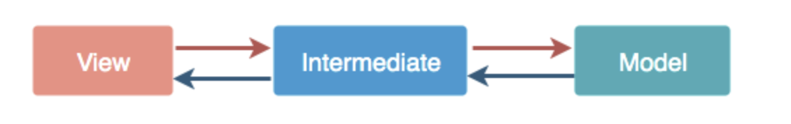
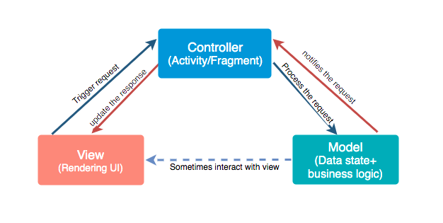
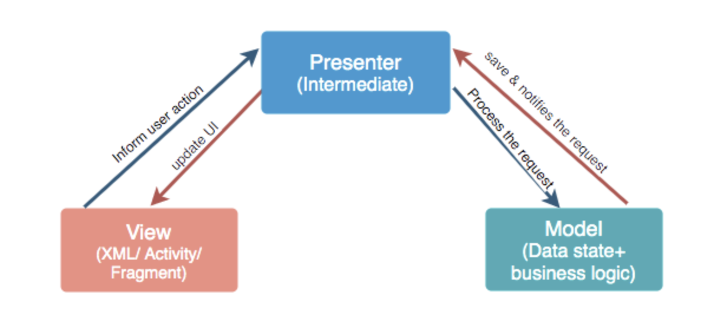
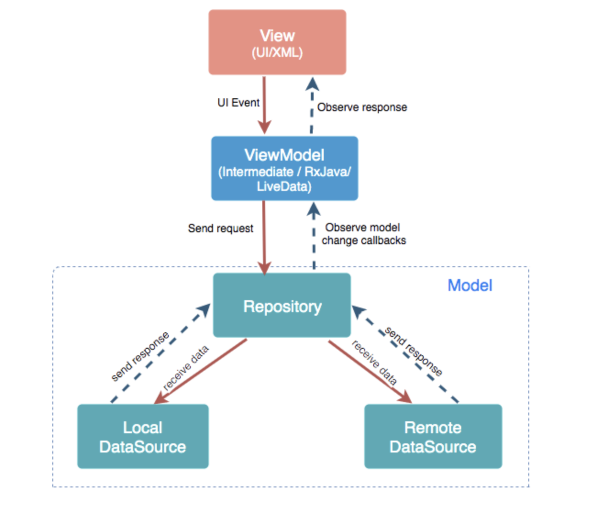

#### What is Architecture?

If you are building an application in an organized manner with some set of rules, describe proper functionalities and implement it with proper protocols, then it is called an Architecture.

#### Some principles for good Architecture in Android

- **Separation of concern:** Component should do what it is required. Shown in the diagram.

  

* **No Hard dependency:** It should be fixed if every component should work on some limited amount of dependency. All dependencies should be provided from outside. Use *Dependency Injections.* 

* **Manage lifecycle and data persistence**: It can be achieved by *Architecture Component.* 

MVC, MVP, MVVM are some popular architecture patterns.

#### MVC:

It is a Model-View-Controller. 

***Model****- It is business logic and Data State. Getting and manipulating the data, communicates with the controller, interacts with the database, sometimes update the views.*
***View****- What we see. User Interface consists of HTML/CSS/XML. It communicates with the controller and sometimes interacts with the model. It passed some dynamic views through the controller.*
**Controller**- *It is Activity/Fragment. It communicates with view and model. It takes the user input from view/REST services. Process request Get data from the model and passes to the view.*

Advantages

- It keeps business logic separate in the model. 它使模型中的业务逻辑保持分离
- Support asynchronous techniques. 支持异步技术
- The modification does not affect the entire model. 修改不影响整个模型
- Faster development process. 更快的开发过程

Disadvantages

- Due to large code controller is unmanageable. 由于大代码控制器难以管理
- Hinders the Unit testing. 阻碍单元测试
- Increased Complexity. 增加的复杂性

#### MVP:

It as Model-View-Presenter. For the phase of developing time or for the phase of developers it is vital to divide the architecture into layers. It breaks the dependency on what we have on view.

**Model**- *It is business logic and Data State. Getting and manipulating the data, communicates with the presenter, interacts with the database. It doesn't interact with the view.*
***View*** *- Consists of UI, activity, and fragment. It interacts with the presenter.*
**Presenter**- *It presents the data from the model. Control all the behavior that want to display from the app. It drives the view. It tells view what to do. Any interaction between the model and the view is handled by the presenter. Saves the data back to the model.*

Advantages

- It makes view dumb so that you can swap the view easily. 它使视图变得愚蠢，以便您可以轻松地交换视图
- Reusable of View and Presenter. 视图和演示器的可重用
- Code is more readable and maintainable. 代码更具可读性和可维护性
- Easy testing as business logic separated from UI. 业务逻辑与 UI 分离，易于测试

Disadvantages

- Tight coupling between View and Presenter. View 和 Presenter 之间的紧密耦合
- Huge amount of interfaces for interaction between layers. 层间交互的大量接口
- The code size is quite excessive. 代码量过大

#### MVVM:

It is a Model-View-ViewModel. It losses the tight coupling between each component and reduces the glue classes. Works on the concept of observables. Children don't have reference to the parent, they only have reference by observables.

**Model**- *It has business logic, local and remote data source and repository.Repository: communicate with local or remote data sources according to the request from ViewModel.*
**View**- *Only user interaction i.e.XML, no business logic. Direct send user action to view model but does not directly get a response. To get a response view observes some data which ViewModel exposes.*
**ViewModel**- *Most of the user interface logic center it here. It is a bridge between a view and a business logic. It does not have any clue which view has to use it. As it does not have a direct reference to the view. Thus, good in testing and has loose coupling. But still, it needs to update the UI this interaction done by observables. When data changes observable notifies.*

Advantages

- No tight coupling between the view and view model. 视图和视图模型之间没有紧耦合
- No interfaces between view and model. 视图和模型之间没有接口
- Easy to unit testing and code is event-driven. 易于单元测试和代码是事件驱动的

Disadvantage

- You have to create observables for each UI component. 您必须为每个 UI 组件创建可观察对象
- The code size is quite excessive. 代码量过大

