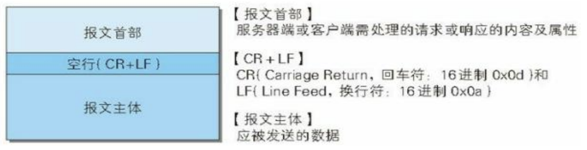
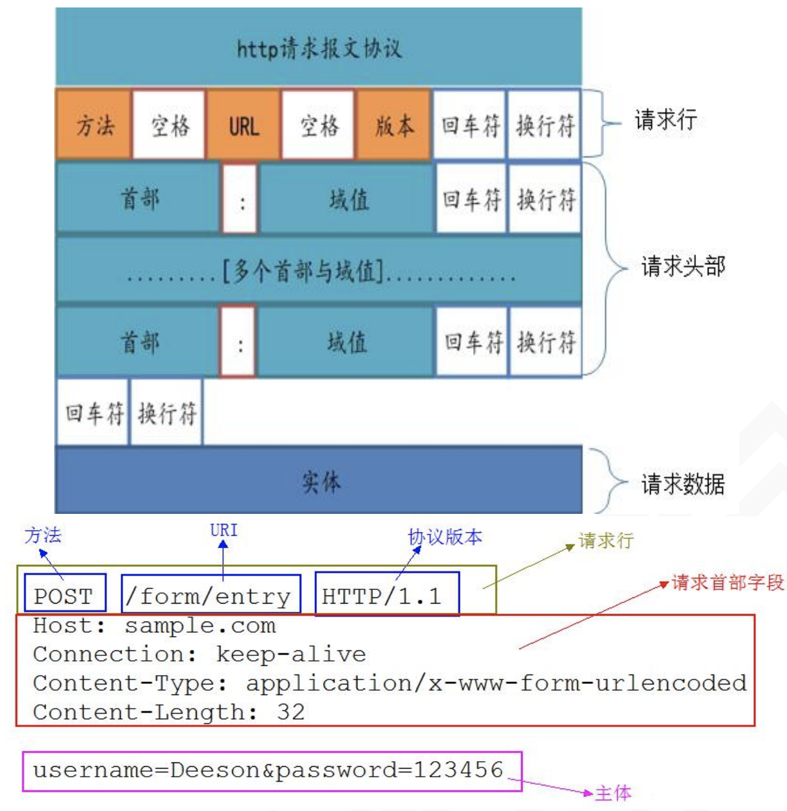
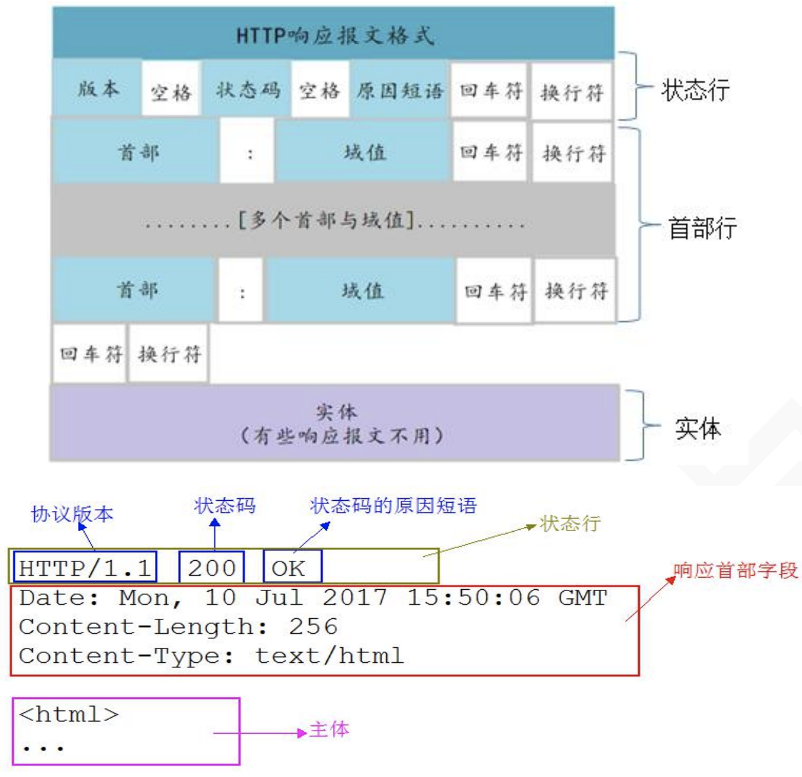
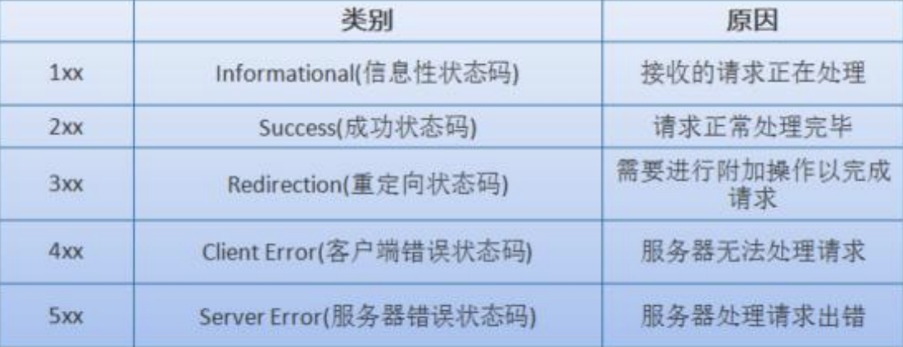

# Http概述

## HTTP 协议

我们使用 http 来访问 Web 上某个资源，比如 html/文本、word、avi 电影、其他资源。 官方协议网站：https://tools.ietf.org/html/rfc2608

## URI 和 URL 的区别

URI 是个纯粹的句法结构，用于指定标识 Web 资源的字符串的各个不同部分。URL 是 URI 的一个特例，它包含了定位 Web 资源的足够信息。

## 一个完整的 URL

包括以下几部分： 

http://www.androidblog.com:8080/news/index.asp?boardID=5&ID=24618&page=1#name 

1.协议部分：该 URL 的协议部分为“http：”，这代表网页使用的是 HTTP 协议。在 Internet 中可以使用多种协议，如 HTTP，FTP 等等本例中使用的是 HTTP 协议。在"HTTP"后面的“//” 为分隔符

2.域名部分：该 URL 的域名部分为“www.androidblog.com”。一个 URL 中，也可以使用 IP 地址作为域名使用

3.端口部分：跟在域名后面的是端口，域名和端口之间使用“:”作为分隔符。端口不是 一个 URL 必须的部分，如果省略端口部分，将采用默认端口

4.虚拟目录部分：从域名后的第一个“/”开始到最后一个“/”为止，是虚拟目录部分。 虚拟目录也不是一个 URL 必须的部分。本例中的虚拟目录是“/news/”

5.文件名部分：从域名后的最后一个“/”开始到“？”为止，是文件名部分，如果没 有“?”,则是从域名后的最后一个“/”开始到“#”为止，是文件部分，如果没有“？”和 “#”，那么从域名后的最后一个“/”开始到结束，都是文件名部分。本例中的文件名是 “index.asp”。文件名部分也不是一个 URL 必须的部分，如果省略该部分，则使用默认的文 件名

6.参数部分：从“？”开始到“#”为止之间的部分为参数部分，又称搜索部分、查询 部分。本例中的参数部分为“boardID=5&ID=24618&page=1”。参数可以允许有多个参数， 参数与参数之间用“&”作为分隔符。

7.锚部分：从“#”开始到最后，都是锚部分。本例中的锚部分是“name”。锚部分也 不是一个 URL 必须的部分

## 一次完整 http 请求的过程

1、首先进行 DNS 域名解析（本地浏览器缓存、操作系统缓存或者 DNS 服务器）

* a）首先 会搜索浏览器自身的 DNS 缓存（缓存时间比较短，大概只有 1 分钟，且只能容纳 1000 条缓 存） 
* b）如果浏览器自身的缓存里面没有找到，那么浏览器会搜索系统自身的 DNS 缓存 
* c）如果还没有找到，那么尝试从 hosts 文件里面去找 
* d）在前面三个过程都没获取到的情况下，就去域名服务器去查找

2、三次握手建立 TCP 连接 在 HTTP 工作开始之前，客户端首先要通过网络与服务器建立连接，HTTP 连接是通过 TCP 来完成的。HTTP 是比 TCP 更高层次的应用层协议，根据规则，只有低层协议建立之 后，才能进行高层协议的连接，因此，首先要建立 TCP 连接，一般 TCP 连接的端口号是 80； 

3、客户端发起 HTTP 请求 

4、服务器响应 HTTP 请求 

5、客户端解析 html 代码，并请求 html 代码中的资源 浏览器拿到 html 文件后，就开始解析其中的 html 代码，遇到 js/css/image 等静态资源 时，就向服务器端去请求下载 

6、客户端渲染展示内容 

7、关闭 TCP 连接

一般情况下，一旦服务器向客户端返回了请求数据，它就要关闭 TCP 连接，然后如果 客户端或者服务器在其头信息加入了这行代码 Connection:keep-alive ，TCP 连接在发送后 将仍然保持打开状态，于是，客户端可以继续通过相同的连接发送请求，也就是说前面的 3 到 6，可以反复进行。保持连接节省了为每个请求建立新连接所需的时间，还节约了网络带宽。

## HTTP 协议报文结构

用于 HTTP 协议交互的信息被称为 HTTP 报文。

请求端（客户端）的 HTTP 报文叫做**请求报文**；响应端（服务器端）的叫做**响应报文**。

HTTP 报文本身是由多行（用 CR+LF 作 换行符）数据构成的字符串文本。HTTP 报文大致可分为**报文首部**和**报文主体**两部分。两者由最初出现的空行（CR+LF） 来划分。通常，并不一定有报文主体。

### 请求报文结构

请求行 —— 包含用于请求的方法、请求 URI 和 HTTP 版本。 

首部字段 —— 包含表示请求的各种条件和属性的各类首部。（通用首部、请求首部、 实体首部以及 RFC 里未定义的首部如 Cookie 等）

### 响应报文结构

状态行 —— 包含表明响应结果的状态码、原因短语和 HTTP 版本。 

首部字段 —— 包含表示请求的各种条件和属性的各类首部。（通用首部、响应首部、 实体首部以及 RFC 里未定义的首部如 Cookie 等）

