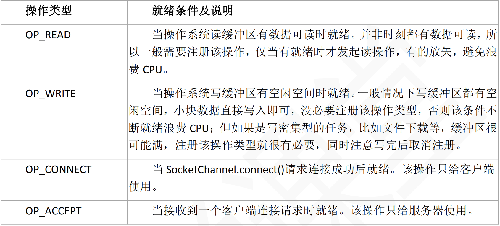
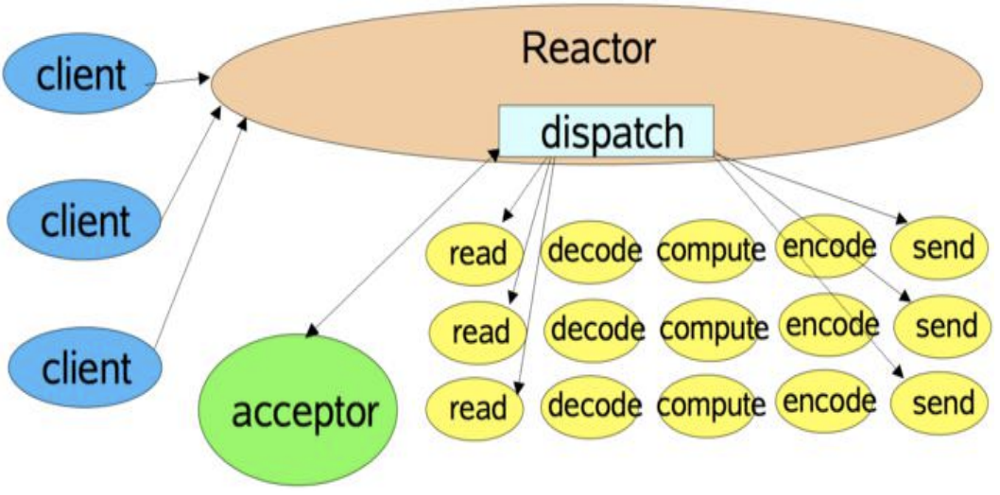
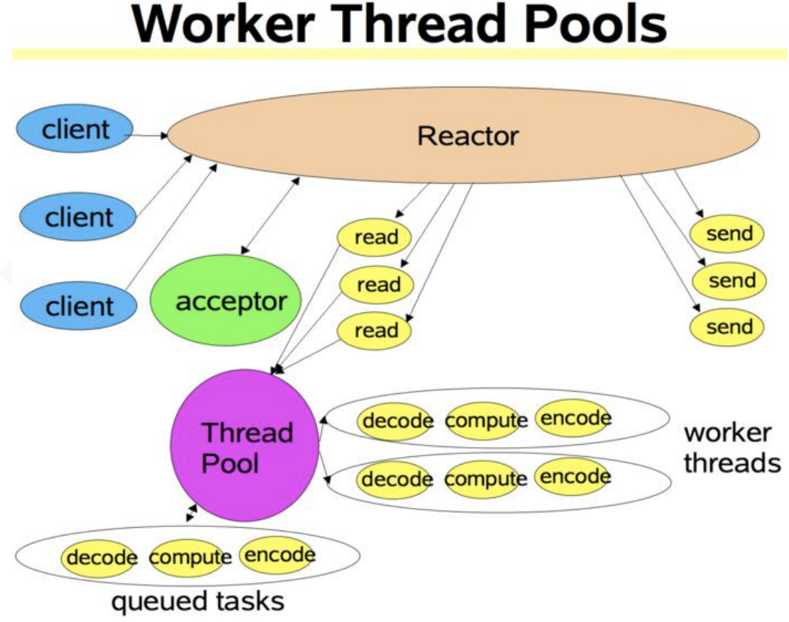
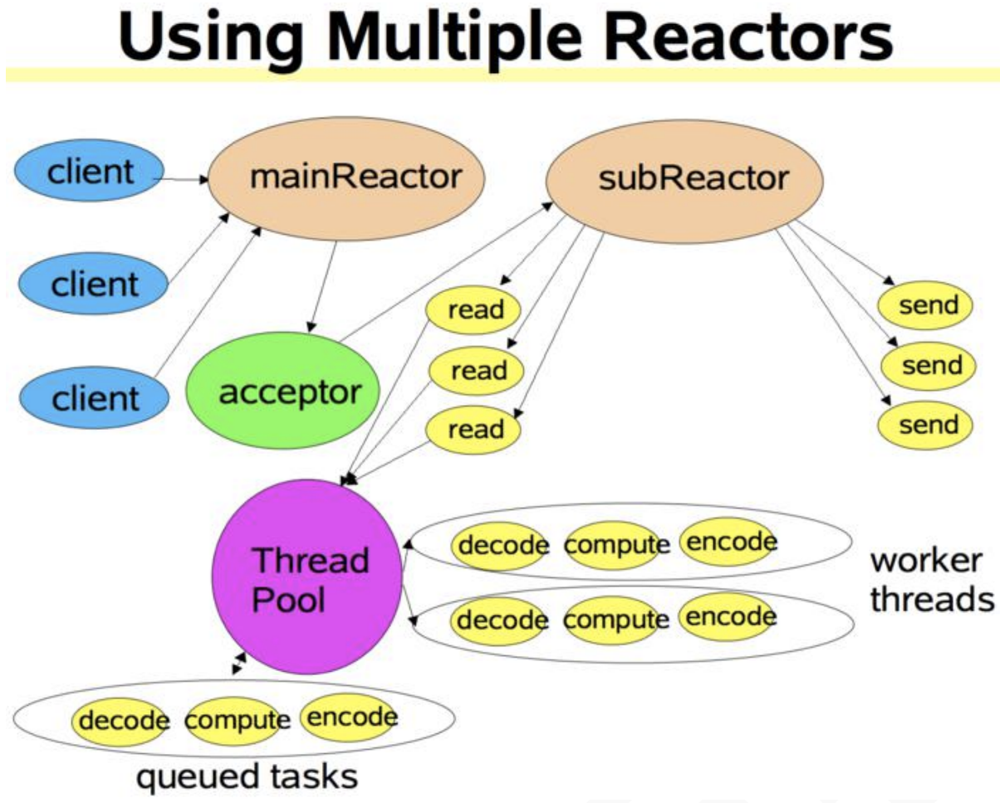

# Java 原生网络编程

短连接： 连接->传输数据->关闭连接 传统 HTTP 是无状态的，浏览器和服务器每进行一次 HTTP 操作，就建立一次连接，但任 务结束就中断连接。 也可以这样说：短连接是指 SOCKET 连接后发送后接收完数据后马上断开连接。 

长连接： 连接->传输数据->保持连接 -> 传输数据-> 。。。 ->关闭连接。 长连接指建立 SOCKET 连接后不管是否使用都保持连接。

## 原生 JDK 网络编程 BIO

传统的同步阻塞模型开发中，ServerSocket 负责绑定 IP 地址，启动监听端口；Socket 负 责发起连接操作。连接成功后，双方通过输入和输出流进行同步阻塞式通信。

传统 BIO 通信模型：采用 BIO 通信模型的服务端，通常由一个独立的 Acceptor 线程负 责监听客户端的连接，它接收到客户端连接请求之后为每个客户端创建一个新的线程进行链 路处理，处理完成后，通过输出流返回应答给客户端，线程销毁。即典型的一请求一应答模 型，同时数据的读取写入也必须阻塞在一个线程内等待其完成。

该模型最大的问题就是缺乏弹性伸缩能力，当客户端并发访问量增加后，服务端的线程 个数和客户端并发访问数呈 1:1 的正比关系，Java 中的线程也是比较宝贵的系统资源，线程 数量快速膨胀后，系统的性能将急剧下降，随着访问量的继续增大，系统最终就死-掉-了。

为了改进这种一连接一线程的模型，我们可以使用线程池来管理这些线程，实现 1 个或 多个线程处理 N 个客户端的模型（但是底层还是使用的同步阻塞 I/O），通常被称为“伪异 步 I/O 模型“。

我们知道，如果使用 CachedThreadPool 线程池，其实除了能自动帮我们管理线程（复用），看起来也就像是 1:1 的客户 端：线程数模型，而使用 FixedThreadPool 我们就有效的控制了线程的最大数量，保证了系 统有限的资源的控制，实现了 N:M 的伪异步 I/O 模型。

但是，正因为限制了线程数量，如果发生读取数据较慢时（比如数据量大、网络传 输慢等），大量并发的情况下，其他接入的消息，只能一直等待，这就是最大的弊端。

### BIO 应用-RPC 框架

#### 什么是 RPC？

RPC（Remote Procedure Call ——远程过程调用），它是一种通过网络从远程计算机程 序上请求服务，而不需要了解底层网络的技术。

#### 一次完整的 RPC 同步调用流程

1）服务消费方（client）以本地调用方式调用客户端存根；

2）什么叫客户端存根？就是远程方法在本地的模拟对象，一样的也有方法名，也有方法参数，client stub 接收到调用后负责将方法名、方法的参数等包装，并将包装后的信息通过网络发送到服务端；

3）服务端收到消息后，交给代理存根在服务器的部分后进行解码为实际的方法名和参数

4） server stub 根据解码结果调用服务器上本地的实际服务

5）本地服务执行并将结果返回给 server stub

6）server stub 将返回结果打包成消息并发送至消费方

7）client stub 接收到消息，并进行解码

8）服务消费方得到最终结果

#### 实现 RPC 框架

##### 实现 RPC 框架需要解决的哪些问题？

* 代理问题

代理本质上是要解决什么问题？要解决的是被调用的服务本质上是远程的服务，但是调用者不知道也不关心，调用者只要结果，具体的事情由代理的那个对象来负责这件事。既然是远程代理，当然是要用代理模式了。 

代理(Proxy)是一种设计模式，即通过代理对象访问目标对象。这样做的好处是：可以在目标对象实现的基础上，增强额外的功能操作，即扩展目标对象的功能。那我们这里额外的功能 操作是干什么，通过网络访问远程服务。 

jdk 的代理有两种实现方式：静态代理和动态代理。

* 序列化问题

序列化问题在计算机里具体是什么？我们的方法调用，有方法名，方法参数，这些可能是字符串，可能是我们自己定义的 java 的类，但是在网络上传输或者保存在硬盘的时候， 网络或者硬盘并不认得什么字符串或者 javabean，它只认得二进制的 01 串，怎么办？要进 行序列化，网络传输后要进行实际调用，就要把二进制的 01 串变回我们实际的 java 的类， 这个叫反序列化。java 里已经为我们提供了相关的机制 Serializable。

* 通信问题

我们在用序列化把东西变成了可以在网络上传输的二进制的 01 串，但具体如何通过网 络传输？使用 JDK 为我们提供的 BIO。

* 登记的服务实例化

登记的服务有可能在我们的系统中就是一个名字，怎么变成实际执行的对象实例，当然是使用反射机制。 反射机制是什么？ 反射机制是在运行状态中，对于任意一个类，都能够知道这个类的所有属性和方法；对于任意一个对象，都能够调用它的任意一个方法和属性；这种动态获取的信息以及动态调用对象的方法的功能称为 java 语言的反射机制。

## 原生 JDK 网络编程- NIO

### 什么是 NIO？

NIO 库是在 JDK 1.4 中引入的。NIO 弥补了原来的 I/O 的不足，它在标准 Java 代码 中提供了高速的、面向块的 I/O。

### 和 BIO 的主要区别

#### 面向流与面向缓冲

Java NIO 和 BIO 之间第一个最大的区别是，BIO 是面向流的，NIO 是面向缓冲区的。

 Java BIO 面向流意味着每次从流中读一个或多个字节，直至读取所有字节，它们没有被缓存在任何地 方。此外，它不能前后移动流中的数据。如果需要前后移动从流中读取的数据，需要先将它 缓存到一个缓冲区。

 Java NIO 的缓冲导向方法略有不同。数据读取到一个它稍后处理的缓 冲区，需要时可在缓冲区中前后移动。这就增加了处理过程中的灵活性。但是，还需要检查 是否该缓冲区中包含所有需要处理的数据。而且，需确保当更多的数据读入缓冲区时，不要 覆盖缓冲区里尚未处理的数据。

#### 阻塞与非阻塞 IO

Java IO 的各种流是阻塞的。这意味着，当一个线程调用 read() 或 write()时，该线程被阻塞，直到有一些数据被读取，或数据完全写入。该线程在此期间不能再干任何事情了。 

Java NIO 的非阻塞模式，使一个线程从某通道发送请求读取数据，但是它仅能得到目前可用的数据，如果目前没有数据可用时，就什么都不会获取。而不是保持线程阻塞，所以直至数据变的可以读取之前，该线程可以继续做其他的事情。 非阻塞写也是如此。一个线 程请求写入一些数据到某通道，但不需要等待它完全写入，这个线程同时可以去做别的事情。 线程通常将非阻塞 IO 的空闲时间用于在其它通道上执行 IO 操作，所以一个单独的线程现在 可以管理多个输入和输出通道（channel）。

### NIO 三大核心组件

NIO 有三大核心组件：Selector 选择器、Channel 管道、buffer 缓冲区。

#### Selector

Selector 的英文含义是“选择器”，也可以称为为“轮询代理器”、“事件订阅器”、“channel 容器管理机”都行。

 Java NIO 的选择器允许一个单独的线程来监视多个输入通道，你可以注册多个通道使用 一个选择器(Selectors)，然后使用一个单独的线程来操作这个选择器，进而“选择”通道： 这些通道里已经有可以处理的输入，或者选择已准备写入的通道。这种选择机制，使得一个 单独的线程很容易来管理多个通道。 

应用程序将向 Selector 对象注册需要它关注的 Channel，以及具体的某一个 Channel 会 对哪些 IO 事件感兴趣。Selector 中也会维护一个“已经注册的 Channel”的容器。

#### Channels 

通道，被建立的一个应用程序和操作系统交互事件、传递内容的渠道（注意是连接到操作系统）。那么既然是和操作系统进行内容的传递，那么说明应用程序可以通过通道读取数 据，也可以通过通道向操作系统写数据，而且可以同时进行读写。 

* 所有被 Selector（选择器）注册的通道，只能是继承了 SelectableChannel 类的子类。 
* ServerSocketChannel：应用服务器程序的监听通道。只有通过这个通道，应用程序才 能向操作系统注册支持“多路复用 IO”的端口监听。同时支持 UDP 协议和 TCP 协议。 
* SocketChannel：TCP Socket 套接字的监听通道，一个 Socket 套接字对应了一个客户 端 IP：端口 到 服务器 IP：端口的通信连接。 

#### buffer 缓冲区

通道中的数据总是要先读到一个 Buffer，或者总是要从一个 Buffer 中写入。

##### 成员变量

* capacity
  * 作为一个内存块，Buffer 有一个固定的大小值，也叫“capacity”.你只能往里写 capacity 个 byte、long，char 等类型。一旦 Buffer 满了，需要将其清空（通过读数据或者清除数据） 才能继续写数据往里写数据。
* position
  * 当你写数据到 Buffer 中时，position 表示当前能写的位置。初始的 position 值为 0.当一 个 byte、long 等数据写到 Buffer 后， position 会向前移动到下一个可插入数据的 Buffer 单 元。position 最大可为 capacity – 1。
  * 当读取数据时，也是从某个特定位置读。当将 Buffer 从写模式切换到读模式，position 会被重置为 0. 当从 Buffer 的 position 处读取数据时，position 向前移动到下一个可读的位置。
* limit
  * 在写模式下，Buffer 的 limit 表示你最多能往 Buffer 里写多少数据。 写模式下，limit 等 于 Buffer 的 capacity。
  * 当切换 Buffer 到读模式时， limit 表示你最多能读到多少数据。因此，当切换 Buffer 到 读模式时，limit 会被设置成写模式下的 position 值。换句话说，你能读到之前写入的所有数 据（limit 被设置成已写数据的数量，这个值在写模式下就是 position）

##### 分配方法

要想获得一个 Buffer 对象首先要进行分配。 每一个 Buffer 类都有 allocate 方法(可以在 堆上分配，也可以在直接内存上分配)。

HeapByteBuffer 与 DirectByteBuffer，在原理上，前者可以看出分配的 buffer 是在 heap 区域的，其实真正 flush 到远程的时候会先拷贝到直接内存，再做下一步操作；在 NIO 的框 架下，很多框架会采用 DirectByteBuffer 来操作，这样分配的内存不再是在 java heap 上，经过性能测试，可以得到非常快速的网络交互，在大量的网络交互下，一般速度会比 HeapByteBuffer 要快速好几倍。

NIO 可以使用 Native 函数库直接分配堆外内存，然后通过一个存储在 Java 堆里面的 DirectByteBuffer 对象作为这块内存的引用进行操作。这样能在一些场景中显著提高性能， 因为避免了在 Java 堆和 Native 堆中来回复制数据。

**直接内存（堆外内存）与堆内存比较**

直接内存申请空间耗费更高的性能，当频繁申请到一定量时尤为明显 

直接内存 IO 读写的性能要优于普通的堆内存，在多次读写操作的情况下差异明显

##### 读写操作

写数据到 Buffer 有两种方式： 

* 读取 Channel 写到 Buffer。 
* 通过 Buffer 的 put()方法写到 Buffer 里。

flip()方法 

flip 方法将 Buffer 从写模式切换到读模式。调用 flip()方法会将 position 设回 0，并将 limit 设置成之前 position 的值。

从 Buffer 中读取数据有两种方式： 

* 从 Buffer 读取数据写入到 Channel。 
* 使用 get()方法从 Buffer 中读取数据。

rewind()方法 

Buffer.rewind()将 position 设回 0，所以你可以重读 Buffer 中的所有数据。limit 保持不变， 仍然表示能从 Buffer 中读取多少个元素（byte、char 等）。

### 重要概念

#### SelectionKey

SelectionKey是一个抽象类,表示selectableChannel在Selector中注册的标识.每个Channel 向 Selector 注册时,都将会创建一个 SelectionKey。SelectionKey 将 Channel 与 Selector 建立了 关系,并维护了 channel 事件。

在向 Selector 对象注册感兴趣的事件时，JAVA NIO 共定义了四种：OP_READ、OP_WRITE、 OP_CONNECT、OP_ACCEPT（定义在 SelectionKey 中），分别对应读、写、请求连接、接受 连接等网络 Socket 操作。

**服务端和客户端分别感兴趣的类型**

服务器启动 ServerSocketChannel，关注 OP_ACCEPT 事件， 

客户端启动 SocketChannel，连接服务器，关注 OP_CONNECT 事件 

服务器接受连接，启动一个服务器的 SocketChannel，这个 SocketChannel 可以关注 OP_READ、OP_WRITE 事件，一般连接建立后会直接关注 OP_READ 事件 

客户端这边的客户端 SocketChannel 发现连接建立后，可以关注 OP_READ、OP_WRITE 事件，一般是需要客户端需要发送数据了才关注 OP_READ 事件 

连接建立后客户端与服务器端开始相互发送消息（读写），根据实际情况来关注OP_READ、 OP_WRITE 事件。

### NIO 之 Reactor 模式

#### 单线程 Reactor 模式流程

* 服务器端的 Reactor 是一个线程对象，该线程会启动事件循环，并使用 Selector(选 择器)来实现 IO 的多路复用。注册一个 Acceptor 事件处理器到 Reactor 中，Acceptor 事件处 理器所关注的事件是 ACCEPT 事件，这样 Reactor 会监听客户端向服务器端发起的连接请求 事件(ACCEPT 事件)。
* 客户端向服务器端发起一个连接请求，Reactor 监听到了该 ACCEPT 事件的发生并将 该 ACCEPT 事件派发给相应的 Acceptor 处理器来进行处理。Acceptor 处理器通过 accept()方 法得到与这个客户端对应的连接(SocketChannel)，然后将该连接所关注的 READ 事件以及对 应的 READ 事件处理器注册到 Reactor 中，这样一来 Reactor 就会监听该连接的 READ 事件了。
* 当 Reactor 监听到有读或者写事件发生时，将相关的事件派发给对应的处理器进行 处理。比如，读处理器会通过 SocketChannel 的 read()方法读取数据，此时 read()操作可以直 接读取到数据，而不会堵塞与等待可读的数据到来。
* 每当处理完所有就绪的感兴趣的 I/O 事件后，Reactor 线程会再次执行 select()阻塞等 待新的事件就绪并将其分派给对应处理器进行处理。

注意，Reactor 的单线程模式的单线程主要是针对于 I/O 操作而言，也就是所有的 I/O 的 accept()、read()、write()以及 connect()操作都在一个线程上完成的。

但在目前的单线程 Reactor 模式中，不仅 I/O 操作在该 Reactor 线程上，连非 I/O 的业务 操作也在该线程上进行处理了，这可能会大大延迟 I/O 请求的响应。所以我们应该将非 I/O 的业务逻辑操作从 Reactor 线程上卸载，以此来加速 Reactor 线程对 I/O 请求的响应。

#### 单线程 Reactor，工作者线程池

与单线程 Reactor 模式不同的是，添加了一个工作者线程池，并将非 I/O 操作从 Reactor 线程中移出转交给工作者线程池来执行。这样能够提高 Reactor 线程的 I/O 响应，不至于因 为一些耗时的业务逻辑而延迟对后面 I/O 请求的处理。

使用线程池的优势：

* 通过重用现有的线程而不是创建新线程，可以在处理多个请求时分摊在线程创建和 销毁过程产生的巨大开销。
* 另一个额外的好处是，当请求到达时，工作线程通常已经存在，因此不会由于等待 创建线程而延迟任务的执行，从而提高了响应性。
* 通过适当调整线程池的大小，可以创建足够多的线程以便使处理器保持忙碌状态。 同时还可以防止过多线程相互竞争资源而使应用程序耗尽内存或失败。

对于一些小容量应用场景，可以使用单线程模型。但是对于高负载、大并发或大数据量 的应用场景却不合适，主要原因如下：

* 一个 NIO 线程同时处理成百上千的链路，性能上无法支撑，即便 NIO 线程的 CPU 负 荷达到 100%，也无法满足海量消息的读取和发送
* 当 NIO 线程负载过重之后，处理速度将变慢，这会导致大量客户端连接超时，超时 之后往往会进行重发，这更加重了 NIO 线程的负载，最终会导致大量消息积压和处理超时， 成为系统的性能瓶颈

#### 多 Reactor 线程模式

Reactor 线程池中的每一 Reactor 线程都会有自己的 Selector、线程和分发的事件循环逻 辑。

mainReactor 可以只有一个，但 subReactor 一般会有多个。mainReactor 线程主要负责接 收客户端的连接请求，然后将接收到的 SocketChannel 传递给 subReactor，由 subReactor 来 完成和客户端的通信。

* 注册一个 Acceptor 事件处理器到 mainReactor 中，Acceptor 事件处理器所关注的事 件是 ACCEPT 事件，这样 mainReactor 会监听客户端向服务器端发起的连接请求事件(ACCEPT 事件)。启动 mainReactor 的事件循环。
* 客户端向服务器端发起一个连接请求，mainReactor 监听到了该 ACCEPT 事件并将该 ACCEPT 事件派发给 Acceptor 处理器来进行处理。Acceptor 处理器通过 accept()方法得到与这 个客户端对应的连接(SocketChannel)，然后将这个 SocketChannel 传递给 subReactor 线程池。
* subReactor 线程池分配一个 subReactor 线程给这个 SocketChannel，即，将 SocketChannel 关注的 READ 事件以及对应的 READ 事件处理器注册到 subReactor 线程中。当 然你也注册 WRITE 事件以及 WRITE 事件处理器到 subReactor 线程中以完成 I/O 写操作。 Reactor 线程池中的每一 Reactor 线程都会有自己的 Selector、线程和分发的循环逻辑。
* 当有 I/O 事件就绪时，相关的 subReactor 就将事件派发给响应的处理器处理。注意， 这里 subReactor 线程只负责完成 I/O 的 read()操作，在读取到数据后将业务逻辑的处理放入 到线程池中完成，若完成业务逻辑后需要返回数据给客户端，则相关的 I/O 的 write 操作还 是会被提交回 subReactor 线程来完成。

注意，所以的 I/O 操作(包括，I/O 的 accept()、read()、write()以及 connect()操作)依旧还 是在 Reactor 线程(mainReactor 线程 或 subReactor 线程)中完成的。Thread Pool(线程池)仅用 来处理非 I/O 操作的逻辑。

多 Reactor 线程模式将“接受客户端的连接请求”和“与该客户端的通信”分在了两个 Reactor 线程来完成。mainReactor 完成接收客户端连接请求的操作，它不负责与客户端的通 信，而是将建立好的连接转交给 subReactor 线程来完成与客户端的通信，这样一来就不会 因为 read()数据量太大而导致后面的客户端连接请求得不到即时处理的情况。并且多 Reactor 线程模式在海量的客户端并发请求的情况下，还可以通过实现 subReactor 线程池来将海量 的连接分发给多个 subReactor 线程，在多核的操作系统中这能大大提升应用的负载和吞吐 量。

## Netty使用的是多Reactor线程模式