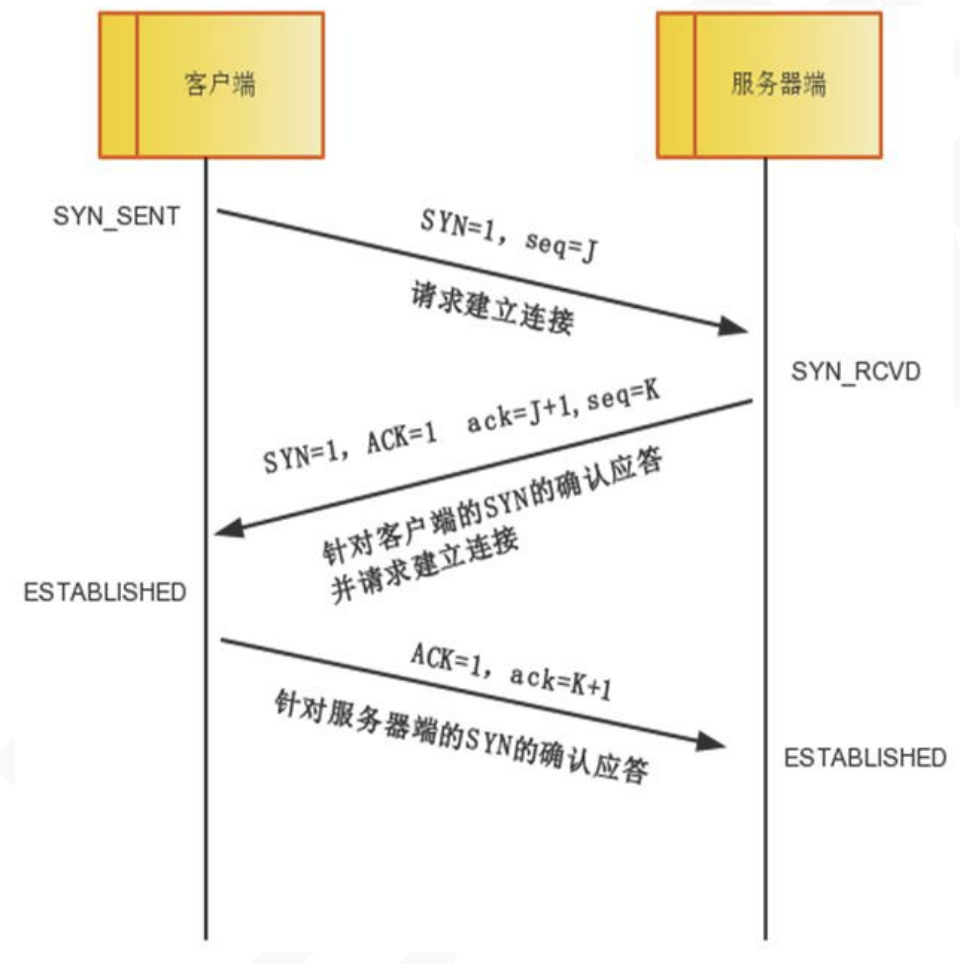
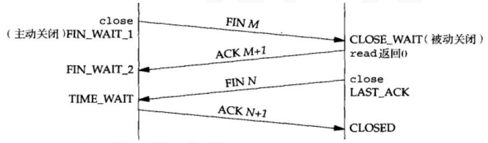

# TCP概述

## 特点

* 可靠
  * TCP 提供的是一种可靠的数据流服务，数据有可能被拆分后发送，那么采用**超时重传机制**和**应答确认机制**组成**TCP可靠传输**的关键设计。
* 重排序
  * IP 层进行数据传输时，是**不能保证数据包按照发送的顺序达到目的机器**。当 IP 将把 它们向‘上’传送到 TCP 层后，TCP 将包排序并进行错误检查。TCP 数据包中包括序号和确认， 所以未按照顺序收到的包可以被排序，而损坏的包可以被重传。

* 流控
  * 还采用一种称为**“滑动窗口”**的方式进行流量控制，所谓窗口实际表示接收能力，用 以限制发送方的发送速度。

* 全双工
  * TCP 还允许在一个 TCP 连接上，通信的双方可以同时传输数据。

## 三次握手

所谓三次握手是指建立一个 TCP 连接时需要客户端和服务器端总共发送三个包以确认连接的建立。在 socket 编程中，这一过程由客户端执行 connect 来触发。

* 第一次握手：客户端将标志位 SYN 置为 1，随机产生一个值 seq=J，并将该数据包发送给服务器端，客户端进入 SYN_SENT 状态，等待服务器端确认。
* 第二次握手：服务器端收到数据包后由标志位 SYN=1 知道客户端请求建立连接，服务器端将标志位 SYN 和 ACK 都置为 1，ack=J+1，随机产生一个值 seq=K，并将该数据包发送给 客户端以确认连接请求，服务器端进入 SYN_RCVD 状态。
* 第三次握手：客户端收到确认后，检查 ack 是否为 J+1，ACK 是否为 1，如果正确则将标志位 ACK 置为 1，ack=K+1，并将该数据包发送给服务器端，服务器端检查 ack 是否为 K+1， ACK 是否为 1，如果正确则连接建立成功，客户端和服务器端进入 ESTABLISHED 状态，完成三次握手，随后客户端与服务器端之间可以开始传输数据了。

### 为什么需要三次握手？

TCP 是可靠的传输控制协议，而三次握手是保证数据可靠传输又能提高传输效率的最小次数。为什么？RFC793，也就是 TCP 的协议 RFC 中就谈到了原因，这是因为：

为了实现可靠数据传输， TCP 协议的通信双方，都必须维护一个序列号， 以标识发送出去的数据包中，哪些是已经被对方收到的。三次握手的过程即是通信双方相互告知序列号起始值，并确认对方已经收到了序列号起始值的必经步骤。

如果只是两次握手， 至多只有连接发起方的起始序列号能被确认， 另一方选择的序列 号则得不到确认。

### TCP 的三次握手的漏洞

#### SYN 洪泛攻击

三次握手中有一个第二次握手，服务端向客户端应答请求， 应答请求是需要客户端 IP 的，攻击者就伪造这个 IP，往服务器端狂发送第一次握手的内容， 当然第一次握手中的客户端 IP 地址是伪造的，从而服务端忙于进行第二次握手但是第二次握手当然没有结果，所以导致服务器端被拖累，死机。

##### 解决方案

* 无效连接监视释放
  * 这种方法不停监视所有的连接，包括三次握手的，还有握手一次的，反正是 所有的，当达到一定(与)阈值时拆除这些连接，从而释放系统资源。这种方法对 于所有的连接一视同仁，不管是正常的还是攻击的，所以这种方式不推荐。
* 延缓 TCB 分配方法
  * 一般的做完第一次握手之后，服务器就需要为该请求分配一个 TCB（连接控制资源），通常这个资源需要 200 多个字节。延迟 TCB 的分配，当正常连接建立起来后再分配 TCB 则可以有效地减轻服务器资源的消耗。
* 使用防火墙
  * 防火墙在确认了连接的有效性后，才向内部的服务器（Listener）发起 SYN 请求

## 四次挥手

四次挥手即终止 TCP 连接，就是指断开一个 TCP 连接时，需要客户端和服务端总共发 送 4 个包以确认连接的断开。在 socket 编程中，这一过程由客户端或服务端任一方执行 close 来触发。

* 某个应用进程首先调用 close，我们称该端执行主动关闭（active close)。该端的 TCP 于是发送一个 FIN 分节，表示数据发送完毕，应用进程进入 FIN-WAIT-1（终止等待 1）状态。
* 接收到这个 FIN 的对端执行被动关闭(passive close)，发出确认报文。这个 FIN 由 TCP 确认。因为 FIN 的接收意味着接收端应用进程在相应连接上再无额外数据可接收。接收端进 入了 CLOSE-WAIT（关闭等待）状态，这时候处于半关闭状态，即主动关闭端已经没有数据 要发送了，但是被动关闭端若发送数据，主动关闭端依然要接受。这个状态还要持续一段时 间，也就是整个 CLOSE-WAIT 状态持续的时间。主动关闭端收到确认报文后进入 FIN-WAIT-2 （终止等待 2）状态。
* 一段时间后，被动关闭的应用进程将调用 close 关闭它的套接字。这导致它的 TCP 也 发送一个 FIN。
* 接收这个最终 FIN 的原发送端 TCP（即执行主动关闭的那一端）确认这个 FIN 发出一 个确认 ACK 报文，并进入了 TIME-WAIT（时间等待）状态。注意此时 TCP 连接还没有释放， 必须经过 2∗MSL（最长报文段寿命/最长分节生命期 max segement lifetime，MSL 是任何 IP 数据报能够在因特网中存活的最长时间，任何 TCP 实现都必须为 MSL 选择一个值。RFC 1122[Braden 1989]的建议值是 2 分钟，不过源自 Berkelcy 的实现传统上改用 30 秒这个值。 这意味着 TIME_WAIT 状态的持续时间在 1 分钟到 4 分钟之间）的时间后，当主动关闭端撤 销相应的 TCB 后，才进入 CLOSED 状态。
* 被动关闭端只要收到了客户端发出的确认，立即进入 CLOSED 状态。同样，撤销 TCB 后，就结束了这次的 TCP 连接。可以看到，被动关闭端结束 TCP 连接的时间要比主动关闭 端早一些。

### 为什么 TCP 的挥手需要四次？

TCP 是全双工的连接，必须两端同时关闭连接，连接才算真正关闭。

### 为什么需要 TIME-WAIT 状态？

TIME_WAIT 状态存在的原因有两点

1、可靠的终止 TCP 连接。 

* 根据前面的四次握手的描述，我们知道，客户端收到服务器的连接释放的 FIN 报文后， 必须发出确认。如最后这个 ACK 确认报文丢失，那么服务器没有收到这个 ACK 确认报文， 就要重发 FIN 连接释放报文，客户端要在某个状态等待这个 FIN 连接释放报文段然后回复确 认报文段，这样才能可靠的终止 TCP 连接。

2、保证让迟来的 TCP 报文有足够的时间被识别并丢弃。

* 在 Linux 系统上，一个 TCP 端口不能被同时打开多次，当一个 TCP 连接处于 TIME_WAIT 状态时，我们无法使用该链接的端口来建立一个新连接。反过来思考，如果不存在 TIME_WAIT 状态，则应用程序能过立即建立一个和刚关闭的连接相似的连接（这里的相似，是指他们具 有相同的 IP 地址和端口号）。这个新的、和原来相似的连接被称为原来连接的化身。新的 化身可能受到属于原来连接携带应用程序数据的 TCP 报文段（迟到的报文段），这显然是不 该发生的。这是 TIME_WAIT 状态存在的第二个原因。

