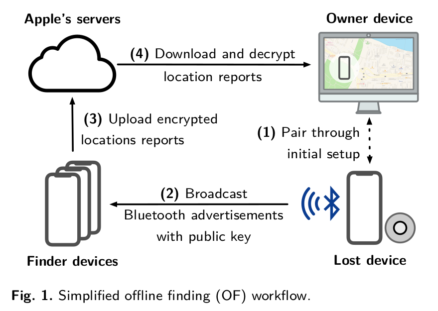
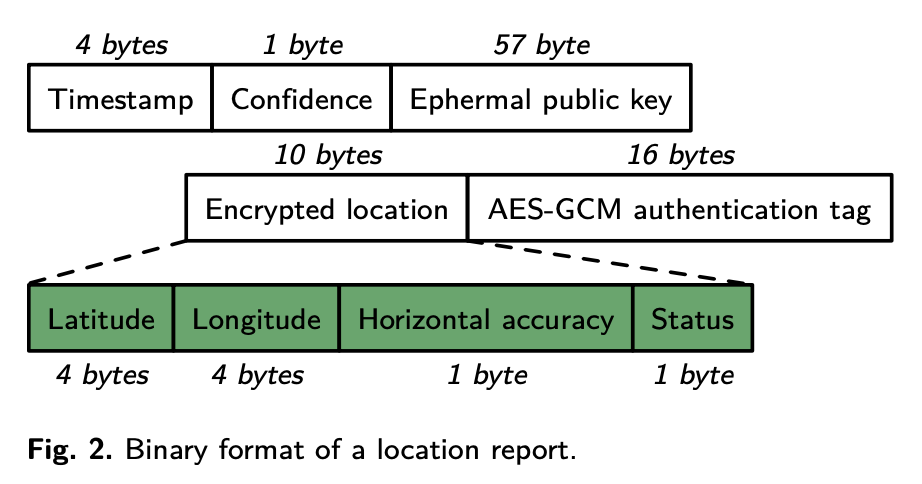

# SendMy

[Send My: Arbitrary data transmission via Apple's Find My network](https://positive.security/blog/send-my)

通过Apple's Find My network传输Arbitrary data

* It's possible to **upload arbitrary data** from **non-internet-connected devices** by sending Find My BLE **broadcasts to nearby Apple devices** that then **upload the data for you**

附近的Apple设备组件成Find My网络，通过BLE广播能将**Arbitrary Data**由未连接的设备**上传**。

* We released an **ESP32 firmware** that turns the micocontroller into an (upload only) modem, and a **macOS application** to retrieve, decode and display the uploaded data: https://github.com/positive-security/send-my

Positive-security发布ESP32固件（模拟AirTag），还发布一个macOS application用来解析、解码和展示上传的数据。

* Being inherent to the privacy and security-focused design of the Find My Offline Finding system, it seems **unlikely that this misuse can be prevented completely**

Find My Offline Finding System以安全隐私为设计核心，Offline System滥用看起来不能被完全阻止。

## Introduce

With the recent release of Apple's AirTags, I was curious whether Find My's Offline Finding network could be (ab)used to upload arbitrary data to the Internet, from devices that are not connected to WiFi or mobile internet. The data would be broadcasted via Bluetooth Low Energy and picked up by nearby Apple devices, that, once they are connected to the Internet, forward the data to Apple servers where it could later be retrieved from. Such a technique could be employed by small sensors in uncontrolled environments to avoid the cost and power-consumption of mobile internet. It could also be interesting for exfiltrating data from Faraday-shielded sites that are occasionally visited by iPhone users.

Find My Offline Finding network用于（不能连接wifi或移动数据网络的）设备上传Arbitrary Data的场景。数据通过BLE广播散播，由附近的Apple devices收集，一旦这些Apple devices连上网络，随后向Apple server上传。Offline设备不仅可以指**丢失设备**，还可能是指**Nearby Devices**，这些技术都依赖于一颗脱离“大核”的“小sensor”（节能）。IPhone与AirTags都配备这样的“小sensor”。

In theory this should be possible: If you can emulate two AirTags, you can encode data by activating only one of the two AirTags at a specific point in time. The receiving device could then check which AirTag is active at what time and decode this back to the original data. However, such a scheme seems highly unreliable and probably unusable in real-world situations due to its very low bandwidth (especially with [restriction such as 16 AirTags per Apple ID](https://9to5mac.com/guides/airtag/) it seemed like data transfer could be limited to only a few bits per hour).

即使能模拟两个AirTags，但同一时刻只能通过编码激活其中一个。Receiving devices能够检查出已激活AirTag的激活时间与解码出原始数据。（没看懂这段表达的是什么意思）

Therefore, the feasibility of the idea depends on the system's design and implementation. It turned out that security and privacy decisions in the design of the Offline Finding mechanism make our "use case" quite efficient and almost impossible to protect against.

因此，idea的可行性取决于系统的设计与实现。证明了Offline Finding mechanism的隐私安全设计使得我们的“用例”十分有效，几乎不可能防范。（假的Apple devices利用了该Offline Finding网络，也无法被Apple侦查出？）

## Offline Finding network description

Thanksfully, the protocol has already been extensively reverse engineered by a group of TU Darmstadt, that published the paper ["Who Can *Find My* Devices?](https://arxiv.org/pdf/2103.02282.pdf)" in March 2021 and released a proof-of-concept open source implementation called [OpenHaystack](https://github.com/seemoo-lab/openhaystack), which allows you to create your own accessories that are tracked by Apple's Find My network. Huge credits to the team! Their work made this possible and both our PoC firmware and the Mac application are based on OpenHaystack.

Apple Find My Network的协议已经被破解且发布，其实现在Github上也有对应的项目OpenHaystack（可以自定义创建配件，从而利用Find My Network进行追踪），牛批呀！

A bit simplified, the Find My Offline Finding system works like this:

1. When paring an AirTag with an Apple Device, an Elliptic Curve key pair is collaboratively generated with the public key remaining on the AirTag (and a shared secret to generate rolling public keys)

当AirTag与Apple Device做Pairing时，生成椭圆曲线秘钥对，其中公钥保存在AirTag中，同时还有一个共享秘钥，用来轮换公钥。

2. Every 2 seconds, the AirTag sends a Bluetooth Low Energy broadcast with the public key as content (changes every 15 minute deterministically using the previously shared secret)

AirTag每隔2秒发出一次BLE广播（报文中包含了公钥），公钥每隔15min会轮换一次，计算需要共享秘钥的参与。

3. Nearby iPhones, Macbooks, etc. recognize the Find My broadcast, retrieve their current location, encrypt the location with the broadcasted public key (using [ECIES](https://iacr.org/archive/pkc2003/25670211/25670211.pdf)) and upload the encrypted location report

Nearby Devices在识别到Find My的BLE广播后，获取自身的位置信息，只有广播中的公钥进行ECIES加密，然后上传密文报告。

4. During device search, the paired Owner Device generates the list of the rolling public keys that the AirTag would have used in the last days and queries an Apple service for their SHA256 hashes. The Apple backend returns the encrypted location reports for the requested key ids

Owner Device生成轮换公钥的列表，预期AirTag也会使用这些，查询时会将公钥的SHA256 hashes告诉Apple Server并进行比对，Apple Server将根据这些hashes值返回位置报告的密文

5. The Owner Device decrypts the location reports and shows an approximate location

This quite elegant design comes with a few security properties, including:

* Tracking protection against nearby adversaries via rolling public keys

通过轮流公钥保护附近广播设备的行踪（类似BLE广播地址的随机化）

* No access for Apple to user locations

无法向Apple读取用户位置

However, most interestingly for us, Apple does not know which public keys belong to your AirTag, and therefore which location reports were intended for you. This means the endpoint to request location reports for a specific key id does not perform any authorization (but you need to be authenticated with any Apple ID to access the endpoint).

Apple也无法知道哪个公钥属于你的AirTag，因此也不知道哪份位置报告属于你。这意味着终端请求位置报告时不会对Key Id有任何认证，前提是经过Apple Id的登录认证。

The security solely lies in the encryption of the location reports: The location can only be decrypted with the correct private key, which is infeasible to brute force and only stored on the paired Owner Device.

安全性仅存在于位置报告的机密性，因为位置报告只会被正确的私钥（仅保存在本地，不会被暴击攻击）解密。

## Designing a data exfiltration protocol

From this it seems that the only field that we can use to encode data is the broadcasted EC public key (e.g. we can't influence the GPS coordinates as those are added by the Finding device).

唯一能被用作加密秘钥的就是BLE广播中的EC公钥。

For the next section, let's treat the Apple backend as a shared, public key-value store with SHA256 hashes as key, and encrypted location reports as value, with basic operations:

 Apple Server以Key-Value的形式保存位置报告，公钥的SHA256作为Key，位置报告的密文作为Value。且提供基本操作：

* We can probe whether location reports for a specific SHA256 hash exist or not

Probe某个特定SHA256为Key的Value是否存在

* We can add location reports to a specific SHA256 hash by broadcasting the corresponding public key

根据特定SHA256值添加位置报告

I guess you can already see where this is going: We can set arbitrary bits in the shared key-value store and query them again. If both the sender and receiver agree on an encoding scheme, we can transfer arbitrary data.

显然，我们完全可以Set Arbitrary Bits到Apple Server中，再去访问数据。如果Sender与Reciever商量好编码Scheme，我们可以利用Find My Network来传输Arbitrary Data。

I set out to build a modem that takes a message via the serial interface and then sends out this data in a loop until a new message is received. To ensure we can differentiate a "0"-bit from an unset bit, we will broadcast a different public key depending on the bit value and will query both possible public keys on the receiving side.

我开始打造一款Modem，她可以通过串口接收消息，并通过BLE广播循环发送该数据直到有新的消息过来。确保能够区分开**0-bit**跟**为设置bit**，Sender会广播不同的公钥，Reciever会同时查询多个公钥。（为什么这样做会区分开0-bit跟unset-bit？为什么要区分开？）

There is no guarantee as to when or whether at all specific broadcasts are uploaded to the Apple backend as location reports. This is because some packets might not reach any Apple device and the Finding devices can have highly variable delays between receiving a broadcast and uploading the location report, e.g. depending on their upstream connectivity or power mode. This means our data encoding must be independent of the ordering in which location reports are received, and able to recover partial data streams when some bits are missing entirely. To achieve this, I decided to encode a single bit of data per broadcast together with an index value indicating which bit of the message is being set. Additional message and modem IDs allow the system to be reused for multiple messages and by multiple users.

没有机制保证指定BLE广播在什么时间会上传位置报告，也不保证是否会上传。因为**丢失配件**的广播不一定能找到Finding Device，况且Finding Device可能从接收到BLE广播到上传位置报告之间存在长延时，这取决于Finding Device的连接情况或电源模式。这意味着加密数据能够独立解密，不依赖于接收端对数据的接收顺序，并且在有bits数据丢失时，能够恢复部分的数据流。为了实现她，对消息加上序列号并且进行加密。额外的信息和Modem ID使得系统可支持多用户多消息。

So when sending a specific bit, we create a 28-byte array of the form "[4b bit index] [4b message ID] [4b modem ID] [padding 0s...] [bit value]", treat this as the public key and send BLE advertisements to e.g. broadcast the information "bit 0 of message 0 is 1".

我们创建特定格式的数据（28bytes）发送到Find My Network，并且将她视作公钥。

| octet    | size   | description |
| -------- | ------ | ----------- |
| [0, 4)   | 4bytes | bit index   |
| [4, 8)   | 4bytes | message ID  |
| [8, 12)  | 4bytes | modem ID    |
| [12, 23) | 7bytes | Padding 0s  |
| 23       | 1byte  | bit value   |

To send a full message, the program simply loops over its bits and sends out one advertisement per bit with the public key that encodes its index and value.

应该如何发送完整的消息呢，程式通过简单轮询消息的bits，并且针对每个bit都发出一条BLE广播，并且用公钥加密消息的序列号跟值。

When fetching data, the receiving application will generate the same 28-byte arrays (two per bit, for the possible bit values 0 and 1) and query the Apple service with the SHA256 hashes of those "public keys". Only one of the two key ids should have location reports attached, which can then be interpreted (e.g. bit at index 0 equals 1).

拉取数据时，接收端会生成同样大小的28byte数组，然后传入SHA256向Apple Server来query数据。两个Key中只有一个能够匹配到位置报告，然后位置报告可被解密与解析。

Note: Instead of only transferring one bit per message, we could also e.g. send a full byte by setting the last 8 bit of the public key. While this increases the sending bandwidth, on the receiving side, we now need to request 255 different key ids to fetch/"brute force" one byte (compared to 16 key IDs when it's encoded bit-by-bit).

如果用8bits来变化作为公钥的话，接收端则会生成255种不同的Key去query Apple Server，除了增加带宽外，Owner Device还需要根据255种秘钥进行暴力解密。

## Implementation

### Sending side

“丢失设备”端

For the sending side I chose the ESP32, as it is a very common and low-cost microcontroller (and in a quick test it could change its BT MAC address much more quickly than e.g. a Linux-based Raspberry Pi). On boot, the OpenHaystack-based firmware broadcasts a hardcoded default message and then listens on the serial interface for any new data to broadcast in a loop until a new message is received. Broadcasting the public key actually means splitting it up and encoding the first 6 bytes in the Bluetooth MAC address (except for the first two bits as the Bluetooth standard requires them to be set to 1). You can check [Section 6.2 in the TU Darmstadt paper](https://arxiv.org/pdf/2103.02282.pdf) for more details on this hacky encoding.

使用ESP32作为“丢失设备”。启动时，OpenHaystack会监听串口的消息，同时进行默认消息的循环BLE广播，直到收到新的串口消息。广播公钥实际上意味着拆分她且编码前6bytes大小的蓝牙MAC地址。（没看懂这句是什么意思？）

I added a static prefix to my payload to not run into issues with the BT specification, and also included the incrementing bit index in the first 6 bytes of the public key, resulting in a different BT MAC address used for each transmitted bit, just in case there is some MAC address based rate limiting somewhere in the stack.

我会为消息添加特殊的前缀避免遇到蓝牙规范问题，同时也包含递增的序列号在公钥的前6个bytes中。导致每个transmitted bit使用不同的蓝牙MAC地址，那么消息传输速率的限制就在于MAC地址的变化速度。（ESP32比树莓派的蓝牙MAC地址切换得快，是ESP32的优势。但是，好奇怪的数据传输设计，不知所云）

### Retrieval side

“接收”端，Owner Device

The Mac application is also based on OpenHaystack and uses the same AppleMail plugin trick to send properly authenticated location retrieval requests to the Apple backend. The user is prompted for the 4 byte modem ID (can be set when flashing the ESP firmware), after which the application will automatically fetch, decode and display the message with id 0. Afterwards the user can fetch other messages or change the modem.

MacOS application也是基于OpenHaystack的程式，利用AppleMail plugin欺骗Apple Server，发送合法的位置报告的请求。

A message is fetched 16 bytes (128 bit) at a time (by querying 256 key ids) until no reports can be found (for a full byte).

### Small complication: public key validity

有效公钥的计算（最硬核部分）

Having implemented both the sending and receiving side, I performed a first test by broadcasting and trying to receive a 32 bit value. After a few minutes, I could retrieve 23 out of the 32 bits, each one being unambiguous and with ~100 location reports, but no reports for the remaining 9 bits.

发送端与接收端都已经实现后，我执行第一次测试，广播32bit（4bytes）的内容，并向Apple Server请求。几分钟后，我获取到32bits中的23个bit，且每个消息都是正确的，大约有100多份位置报告，但没有一份报告有关于剩余9bits的消息。

I suspected that some of the generated public keys were rejected by the nearby Apple Devices during the ECIES encryption as invalid public keys, and could quickly confirm this by trying to import each of the generated payloads as SEC1-encoded public keys on the P224 curve using Python's fastecdsa: For every bit that I could not find location reports for, the microcontroller had broadcasted a public key, which throws an InvalidSEC1PublicKey exception during the fastecdsa key import.

我怀疑生成的公钥中有一些是无效的，在Finding Device执行ECIES加密时会发生错误。我用Python‘s fastecdsa包取得了快速验证。

Some background info on the crypto involved:

密码技术涉及如下一些背景知识

- The 28-byte EC public represents the SEC1-encoded X coordinate of a point

28byte大小的EC公钥表示SEC1编码坐标系中一个点的X坐标。（没看懂什么意思）

- A SEC1 public key usually also has a "sign" bit that defines which of the two possible Y coordinates for a specific X coordinate should be encoded. This bit is not broadcasted and irrelevant for the public key's validity

SEC1 公钥通常还有一个“符号”位，用于定义应编码特定 X 坐标的两个可能 Y 坐标中的哪一个。 该位不广播，与公钥的有效性无关。

- During the decoding of a compressed public key, the corresponding Y coordinate is calculated using the fixed curve parameters and tested for validity. This is the test that fails for some of the generated public keys. You can check Section 3.2.2 of "[Validation of Elliptic Curve Public Keys](https://iacr.org/archive/pkc2003/25670211/25670211.pdf)" for more details:

在压缩公钥的解码过程中，使用固定曲线参数计算相应的 Y 坐标并测试其有效性。 这是某些生成的公钥失败的测试。

There are at least two ways to solve this problem of invalid public keys:

1. Before broadcasting a payload, check whether the EC point it represents is actually valid for the used curve. If not, increment a counter until a valid public key is found. This process is deterministic and can similarly be performed offline by the retrieval application before querying a key id

在广播有效载荷之前，请检查它所代表的 EC 点对于所使用的曲线是否确实有效。 如果没有，增加一个计数器直到找到一个有效的公钥。 此过程是确定性的，并且可以类似地由检索应用程序在查询密钥 ID 之前离线执行。

2. Interpret the payload as private key (instead of public key). While a compressed 28 byte public key is interpreted as the X coordinate of a potential point on the curve, a 28 byte private key is interpreted as the scalar in a [EC point/scalar multiplication](https://en.wikipedia.org/wiki/Elliptic_curve_point_multiplication), thus always resulting in a valid point on the curve (the public key)

将有效负载解释为私钥（而不是公钥）。 压缩的 28 字节公钥被解释为曲线上潜在点的 X 坐标，而 28 字节私钥被解释为 [EC 点/标量乘法](https://en.wikipedia.org) 中的标量 /wiki/Elliptic_curve_point_multiplication），因此总是在曲线上产生一个有效点（公钥）

The second option has the advantage that for each received bit, we'd also be able to decrypt the location reports to find out the location it was received at, but it requires a bit more processing. While implementing this option, I found that due to [bugs in the EC multiplication implementation](https://github.com/kmackay/micro-ecc/issues/128) of the used uECC library, for some private keys the ESP would calculate different public keys than both BoringSSL on Mac and Python's fastecdsa (accidential differential fuzzing?). Those public keys were even treated as invalid by uECC's own uECC_valid_public_key() function. I therefore chose to go with option 1 for this PoC.

第二个选项的优点是，对于每个接收到的位，我们还可以解密位置报告以找出接收它的位置，但它需要更多的处理。但uECC库有bug导致生成的公钥不合法，所以最终采用第一个选项。

## Testing / Performance

With the public key validity check implemented, everything worked flawlessly. While I didn't do extensive performance testing and measurements, here are some estimates:

虽然我没有进行大量的性能测试和测量，但这里有一些估计：

- The **sending rate** on the microcontroller is currently **~3 bytes/second**. Higher speeds could be achieved e.g. simply by caching the encoding results or by encoding one byte per advertisement

微控制器上的**发送速率**目前为 **~3 字节/秒**。可以实现更高的速度，例如只需缓存编码结果或对每个广播编码一个字节。

- In my tests, the **receiving rate** was limited by slow Mac hardware. Retrieving **16 bytes** within one request takes **~5 seconds**

在我的测试中，**接收率**受到慢速 Mac 硬件的限制。 在一个请求中检索 **16 字节** 需要 **~5 秒**。

- The **latency** is usually **between 1 and 60 minutes** depending on how many devices are around and other random factors. The following graphic shows the delay distribution between a public key broadcast and the corresponding location report being uploaded. Please note however, that this is per location report upload and does not directly represent the time until broadcasted data can be downloaded (already the first location report from any nearby Apple devices suffices for this)

**延迟**通常**介于 1 到 60 分钟** 之间，具体取决于周围的设备数量和其他随机因素。

## Potential use cases

While I was mostly just curious about whether it would be possible, I would imagine the most common use case to be **uploading sensor readings or any data** from **IoT devices** without a broadband modem, SIM card, data plan or Wifi connectivity. With Amazon [running a similar network called *Sidewalk* that uses Echo devices](https://www.amazon.com/Amazon-Sidewalk/b?ie=UTF8&node=21328123011) there might very well be demand for it. Since the Finding devices cache received broadcasts until they have an Internet connection, the sensors can even send out data from areas without mobile coverage as long as people pass the area.

In the world of **high-security networks**, where combining lasers and scanners seems to be a [noteworthy technique](https://www.schneier.com/blog/archives/2017/04/jumping_airgaps.html) to bridge the airgap, the visitor's Apple devices might also become feasible intermediaries to **exfiltrate data from** certain **airgapped systems** or Faraday caged rooms.

It also seems like the Offline Finding protocol could be used to **deplete nearby iPhone's mobile data plans**. With the number of location reports from a Finder device being limited (to 255 reports/submission due to a 1 byte count value) and each report being over 100 byte, broadcasting many unique public keys should result in an amplified amount of mobile traffic sent by the phone. While I haven't noticed any rate limiting on the number of location reports sent out, I also haven't tested how much data this would consume.

## Mitigation

减轻滥用的情况

As mentioned initially, it would be hard for Apple to defend against this kind of misuse in case they wanted to.

正如最初提到的那样，如果 Apple 愿意的话，很难防范这种滥用。

Apple designed the system on the principle of data economy. They cannot read unencrypted locations and do not know which public keys belong to your AirTag, or even which public key a certain encrypted location report belongs to (as they only receive the public key's SHA256 hash).

苹果根据数据经济的原则设计了该系统。 他们无法读取未加密的位置，也不知道哪些公钥属于您的 AirTag，甚至不知道某个加密位置报告属于哪个公钥（因为他们只接收公钥的 SHA256 哈希值）。

In this light, the stated restriction of 16 AirTags per Apple ID seems interesting, as to me it does not seem that Apple can currently enforce this.

有鉴于此，声明的每个 Apple ID 16 个 AirTag 的限制似乎很有趣，在我看来，Apple 目前似乎无法强制执行此操作。

However, further hardening of the system might e.g. be possible in the following two areas:

然而，系统的进一步强化可能例如 可以在以下两个方面进行：

- **Authentication of the BLE advertisement.** Currently, Finder devices can not differentiate between e.g. an AirTag and a clone based on OpenHaystack, thus allowing the spoofing of many thousand non-existing AirTags to encode and transmit data. Usually one would consider signing the public keys, however with the BLE advertisement size already completely used up, AirTags being low power and not connected to the internet, and the broadcasted keys constantly rotating, this presents quite a challenge.

**BLE 广播的认证。** 目前，Finder 设备无法区分例如 一个 AirTag 和一个基于 OpenHaystack 的克隆，从而允许欺骗数千个不存在的 AirTag 来编码和传输数据。 通常会考虑对公钥进行签名，但是由于 BLE 广播大小已经完全用完，AirTags 低功耗且未连接到互联网，并且广播的密钥不断轮换，这提出了相当大的挑战。

- **Rate limiting of the location report retrieval.** While Apple does not know whether the requested key id belongs to one of the requesting user's AirTag, they could cache the requested key ids and ensure that only 16 new key ids are queried per 15 minutes and Apple ID (after allowing a much higher number for an initial search during the last days). While easier to implement, this mitigation can be bypassed by cycling through multiple free Apple IDs for data retrieval.

**位置报告检索的速率限制。** 虽然 Apple 不知道请求的密钥 ID 是否属于请求用户的 AirTag 之一，但他们可以缓存请求的密钥 ID 并确保每 15 个仅查询 16 个新的密钥 ID 分钟和 Apple ID（在最后几天允许更高的初始搜索数字之后）。 虽然更容易实现，但可以通过循环使用多个免费 Apple ID 进行数据检索来绕过这种缓解措施。

## Conclusion

In this blog post, we have answered the initial question, whether it's possible to upload arbitrary data using other people's Apple devices, with a clear yes.

在这篇博文中，我们已经回答了最初的问题，即是否可以使用其他人的 Apple 设备上传任意数据，答案是肯定的。

An ESP32 modem firmware and macOS data retrieval application was implemented and is [available on Github](https://github.com/positive-security/send-my) for others to experiment with.

Please note that this is a PoC implementation and the "protocol" itself is neither encrypted nor authenticated. Exemplary, you can explore the data of modem ID 0x42424242 by simply entering its ID (maybe in the meantime somebody has also demonstrated the protocol's lack of authentication 😉).

请注意，这是一个 PoC 实现，“协议”本身既未加密也未经过身份验证。 例如，您可以通过简单地输入调制解调器 ID 来探索调制解调器 ID 0x42424242 的数据（也许同时有人也证明了该协议缺乏身份验证😉）。

Final note: While writing this blog post, I noticed a "status" byte that is included in the BLE advertisement and apparently used e.g. as battery level indicator. In combination with deterministically generated rotating private keys, this is probably another way to leak data with one byte per advertisement, but I haven't tested this approach.

最后一点：在写这篇博文时，我注意到 BLE 广播中包含一个“状态”字节，显然使用了例如 作为电池电量指示器。 结合确定性生成的旋转私钥，这可能是另一种以每个广告一个字节泄漏数据的方法，但我还没有测试过这种方法。

# Who Can Find My Devices

**Security and Privacy of Apple’s Crowd-Sourced Bluetooth Location Tracking System**

## Abstract

Overnight, Apple has turned its hundreds-of- million-device ecosystem into the world’s largest crowd- sourced location tracking network called offline finding (OF). OF leverages online finder devices to detect the presence of missing offline devices using Bluetooth and report an approximate location back to the owner via the Internet. While OF is not the first system of its kind, it is the first to commit to strong privacy goals. In particular, OF aims to ensure finder anonymity, un- trackability of owner devices, and confidentiality of location reports. This paper presents the first comprehensive security and privacy analysis of OF. To this end, we recover the specifications of the closed-source OF protocols by means of reverse engineering. We experimentally show that unauthorized access to the location reports allows for accurate device tracking and retrieving a user’s top locations with an error in the order of 10 meters in urban areas. While we find that OF’s design achieves its privacy goals, we discover two distinct design and implementation flaws that can lead to a location correlation attack and unauthorized access to the location history of the past seven days, which could deanonymize users. Apple has partially addressed the issues following our responsible disclosure. Finally, we make our research artifacts publicly available.

一夜之间，Apple将其数以亿计的设备生态系统变成了世界上最大的Crowd-sourced位置跟踪网络，叫做offline finding（OF）。OF利用online finder devices的蓝牙去探测missing offline devices的存在，并通过Internet将大致位置报告给owner。虽然OF不是第一个这种类型的系统，但她却是第一以实现强隐私为目标的这类系统。特别的，OF旨在确保finder的匿名性，owner devices的不可追踪性，位置报告的机密性。本论文对OF做一次全面的安全和隐私分析。为此，我们通过逆向工程技术恢复了闭源协议OF的spec。We experimentally show that unauthorized access to the location reports allows for accurate device tracking and retrieving a user’s top locations with an error in the order of 10 meters in urban areas. 虽然我们证明了OF的设计实现了她的隐私目标，但是我们也发现了两点不同的设计和实现上的flaws，她们可能造成位置关联攻击和过去7天的位置报告的未授权访问，可能造成去匿名化。紧跟我们负责人的曝光，Apple已经修复了其中一些issue。最后，我们公开我们的research artifaces。

## Introduction

In 2019, Apple introduced *offline finding (OF)*, a proprietary crowd-sourced location tracking system for offline devices. The basic idea behind OF is that so-called *finder* devices can detect the presence of other *lost* offline devices using Bluetooth Low Energy (BLE) and use their Internet connection to report an approximate location back to the *owner*. Apple’s OF network consists of “hundreds of millions” of devices [4], making it the currently largest crowd-sourced location tracking system in existence. We expect the network to grow as OF will officially support the tracking of non-Apple devices in the future [6]. Regardless of its size, the system has sparked considerable interest and discussion within the broader tech and security communities [28, 29] as Apple makes strong security and privacy claims supported by new cryptographic primitives that other commercial systems are lacking [51]. In particular, Apple claims that it cannot access location reports, finder identities are not revealed, and BLE advertisements cannot be used to track devices [35]. Apple has yet to provide ample proof for their claims as, until today, only selected components have been publicized [4, 6, 35].

早在2019年，Apple介绍了私有的offline finding（OF），一款针对offline devices的自研的crowd-sourced位置追踪系统。OF背后的基本思想：finder devices利用BLE技术探测其他人lost offline devices，并使用自己的Internet连接上报粗略位置的报告给owner。Apple的OF network由上亿的设备组成，也是目前最大的crowd-sourced位置追踪系统。我们预期网络将进一步壮大，因为OF未来将官方支持non-Apple devices。无论其规模如何，OF系统已经在broader技术和安全社区中sparked considerable兴趣和讨论，因为Apple作出了强安全和隐私声明（由新的cryptographic primitives支持，这是其他商业系统所缺少的）。特别的，Apple表示她自己无法访问位置报告，finder devices的身份也无法被透露，且BLE广播也无法被用来追踪。当然，Apple还没为她的声明提供ample证据，只有选择性地公开其中的组件。

### Contribution

意义与价值

This paper challenges Apple’s security and privacy claims and examines the system design and implementation for vulnerabilities. To this end, we first analyze the involved OF system components on macOS and iOS using reverse engineering and present the proprietary protocols involved during *losing*, *searching*, and *finding* devices. In short, devices of one owner agree on a set of so-called rolling public–private key pairs. Devices without an Internet connection, i.e., without cellular or Wi-Fi connectivity, emit BLE advertisements that encode one of the rolling public keys. Finder devices overhearing the advertisements encrypt their current location under the rolling public key and send the location report to a central Apple-run server. When searching for a lost device, another owner device queries the central server for location reports with a set of known rolling public keys of the lost device. The owner can decrypt the reports using the corresponding private key and retrieve the location.

论文挑战Apple的安全隐私声明，且试验OF系统设计与实现的漏洞。为此，我们首先对macOS和iOS中OF相关模块进行逆向分析，展示在losting，searching和finding三个场景中的Apple自研协议。简而言之，owner与其拥有的devices会协商出一组rolling public-private 密钥对。没有Internet连接的Devices，譬如缺少蜂窝网络与Wifi网络的设备，会发射携带rolling public密钥的BLE广播。监听BLE广播的Finder devices利用rolling public key加密自身的位置信息上传到Apple Server。Search lost devices时，想要位置报告的owner device向Apple Server发送携带一组rolling public key的请求。只有owner device能够解密和解析这些位置报告，因为只有她有对应的私钥。

Based on our analysis, we assess the security and privacy of the OF system. We find that the overall design achieves Apple’s specific goals. However, we discovered two distinct design and implementation vulnerabilities that seem to be outside of Apple’s threat model but can have severe consequences for the users. First, the OF design allows Apple to correlate different owners’ locations if their locations are reported by the same finder, effectively allowing Apple to construct a social graph. Second, malicious macOS applications can retrieve and decrypt the OF location reports of the last seven days for all its users and for *all* of their devices as cached rolling advertisement keys are stored on the file system in cleartext. We demonstrate that the latter vulnerability is exploitable and verify that the accuracy of the retrieved reports—in fact—allows the attacker to locate and identify their victim with high accuracy. We have shared our findings with Apple via responsible disclosure, who have meanwhile fixed one issue via an OS update (CVE-2020-9986, cf. *Responsible Disclosure* section for details). We summarize our key contributions.

基于我们的分析，我们评估OF system的安全性和隐私性。我们说OF系统的整体设计实现了Apple特定的目标。然而，我们发现两处不同的设计实现漏洞，这些漏洞似乎be outside of Apple的威胁模型，但对用户会造成严重后果。

* 第一，OF的设计是允许Apple关联不同owner的位置的，如果他们被同一个finder device上报信息，Apple能高效地构建社交图谱。
* 第二，macOS的恶意程序能够检索和解密用户7天内的位置报告，因为rolling private-key会以明文的形式缓存在文件系统中。

我们demonstrate了后一个漏洞是可被利用的，也验证了被索引出的报告的准确性。事实上，这允许了攻击者可高精准地追踪和识别受害者。我们已经向Apple分享了我们的调查结果，与此同时，Apple通过系统升级已经修复了一个issue。我们总结关键的contributions。

* We provide a comprehensive specification of the OF protocol components for losing, searching, and finding devices. Our PoC （Proof of Concept）implementation allows for tracking non-Apple devices via Apple’s OF network.

  提供了OF系统全面的spec，包括losing，searching和finding场景。理论上证明了我们可以利用OF系统来追踪non-Apple设备。

* We experimentally evaluate the accuracy of real-world location reports for different forms of mobility (by car, train, and on foot). We show that (1) a walking user’s path can be tracked with a mean error of less than 30m in a metropolitan area and (2) the top locations of a user such as home and workplace can be inferred reliably and precisely (error in the order of 10 m) from a one-week location trace.

  我们通过实验评估出不同形式的移动（汽车、火车、步行）在真实世界中位置报告的准确度。我们展示两个结果：1、在metropolitan区域中能以小于30米的误差追踪一个步行路径。2、根据过去1周内最高的位置频率能推断出用户的住所或公司，误差大约在10米。

- We discover a design flaw in OF that lets Apple correlate the location of multiple owners if the same finder submits the reports. This would jeopardize location privacy for all other owners if only a single location became known.

  设计缺陷：同一个finder上传的报告会关联多个用户，只要知道其中一个位置，则会暴露其他用户的位置信息。

- We discover that a local application on macOS can effectively circumvent Apple’s restrictive location API [5] and access the user’s location history without their consent, allowing for device tracking and user identification.

  macOS的程序可高效地circumvent Apple的location API的限制，缺乏用户同意的情况下访问用户的历史位置信息，对设备进行追踪和用户识别。

- We open-source our PoC implementation and experimental data (cf. *Availability* section).

  我们开源了我们的实现和实验数据。

### Outline

* Chapter-2 & Chapter-3 provide background information about OF and the involved technology.
* Chapter-4 outlines our adversary model.
* Chapter-5 summarizes our reverse engineering methodology.
* Chapter-6 describes the OF protocols and components in detail.
* Chapter-7 evaluates the accuracy of OF location reports.
* Chapter-8 assesses the security and privacy of Apple’s OF design and implementation.
* Chapter-9 & Chapter-10 report two discovered vulnerabilities and propose our mitigations.
* Chapter-11 reviews related work.
* Chapter-12 concludes this work.

## Background

This section gives a brief introduction to BLE and elliptic curve cryptography (ECC) as they are the basic building blocks for OF. We then cover relevant Apple platform internals.

对BLE技术和椭圆曲线密码技术进行简单说明，因为他们是构建OF系统的基础。然后对Apple平台相关的内部模块进行说明。

### Bluetooth Low Energy

Bluetooth Low Energy (BLE) [19] is designed for small battery-powered devices such as smartwatches and fitness trackers with low data rates. Devices can broadcast BLE advertisements to inform nearby devices about their presence. The maximum BLE advertisement payload size is 31 bytes [19]. Apple heavily relies on custom BLE advertisements to announce their proprietary services such as AirDrop and bootstrap their protocols over Wi-Fi or Apple Wireless Direct Link (AWDL) [21, 36, 48]. OF devices also use BLE advertisements to inform nearby finders about their presence [6].

### Elliptic Curve Cryptography

OF employs elliptic curve cryptography (ECC) for encrypting location reports. ECC is a public-key encryption scheme that uses operations on elliptic curve (EC) over finite fields. An EC is a curve over a finite field that contains a known generator (or base point) G. A private key in ECC is a random number in the finite field of the used curve. The public key is the result of the point multiplication of the generator G with the private key. The result is an X–Y coordinate on the curve. The NIST P-224 curve [39], which is used by OF [6], provides a security level of 112 bit.

OF系统运用了ECC算法加密位置报告。ECC是一种公钥密码技术that uses operations on elliptic curve (EC) over finite fields. An EC is a curve over a finite field that contains a known generator (or base point) G. A private key in ECC is a random number in the finite field of the used curve. The public key is the result of the point multiplication of the generator G with the private key. The result is an X–Y coordinate on the curve. The NIST P-224 curve, which is used by OF, provides a security level of 112 bit.

### Apple Platform Internals

We briefly introduce the terms keychain and iCloud as they are relevant for Apple’s OF implementation.

#### Keychain

All Apple operating systems (OSs) use a keychain as a database to store secrets such as passwords, keys, and trusted Transport Layer Security (TLS) root certificates. The keychain is used by sys- tem services such as AirDrop [48] and third-party ap- plications to store login information, tokens, and other secrets. Every keychain item may contain a *keychain access group*. This group is used to identify which ap- plication can access which keychain items. Access poli- cies are implemented via *entitlement* files embedded into signed application binaries. A system process prevents the execution of processes with unauthorized entitle- ments, e.g., a third-party application trying to access a system-owned keychain item. This security mechanism can be disabled on jailbroken iOS devices or by deacti- vating macOS system integrity protection (SIP), which helps extracting keys and secrets used by Apple’s sys- tem services.

#### iCloud

iCloud is an umbrella term for all Apple services handling online data storage and synchroniza- tion via Apple’s servers. All *owner* devices signed in to the same Apple account can synchronize themselves via iCloud. OF uses the iCloud keychain to share rolling advertisement keys across all owner devices. The syn- chronization is required to retrieve and decrypt the lo- cation reports from potential finders on any of the owner devices [4, 35].

## Apple Offline Finding Overview

Apple introduced OF in 2019 for iOS 13, macOS 10.15, and watchOS 6 [10]. OF enables locating Apple devices without an Internet connection and promises to operate in a privacy-preserving manner. In 2020, Apple announced to support third-party BLE-enabled devices to be tracked by the OF network [11] and released a protocol specification for their integration [6]. We found that this public specification is incomplete concerning the overall OF system. Within this paper, we focus on our recovered specification that was partly validated by the accessory specification [6].

2019年，Apple推出OF系统。OF能够在没联网的情况下追踪Apple设备，并承诺以保护隐私的方式运行。2020年，Apple宣布OF支持追踪三方BLE设备，并为他们提供了协议spec。我们发现这个公开的spec对于整个OF系统来说是不完全的。本论文中，我们专注于复原能经受accessory_spec（Find_My_network_accessory_protocol_specification）验证的OF_whole_spec。

In the following, we give a brief overview of how OF works and introduce the different roles of devices. Fig. 1 depicts the interplay of the roles and protocols involved in OF. 

In particular, OF involves (1) initial pairing of owner devices, (2) broadcasting BLE advertisements that contain a rolling public key, (3) uploading encrypted location reports to Apple’s servers, and (4) retrieving the location reports on owner devices. The terminology of the roles below has been derived from the official documentation [6].

上图主要介绍了OF系统的工作流程，涉及四类角色与四种协议

Roles（Owner device，Lost device，Finder device，Backend server）

Protocol（Initial Pairing，Broadcasting BLE Adv，uploading & encrypt，retrieving & decrypt）

**Owner devices.** Owner devices share a common Apple ID and can use the *Find My* application on macOS and iOS to search for any devices of the same owner.

**Lost devices.** Devices that determine to be in a lost state start sending out BLE advertisements with a public key to be discovered by finder devices. Apple devices are considered to be lost when they lose Internet connectivity. Third-party accessories [6] are small battery- powered devices that can be attached to a personal item and are set up through an owner device. Accessories determine to be *lost* when they lose their BLE connection to the owner device.

**Finder devices.** Finder devices form the core of the OF network. As of 2020, only iPhones and iPads with a GPS module are offering finder capabilities. Finder devices can discover lost devices and accessories by scanning for BLE advertisements. Upon receiving an OF advertisement, a finder creates an end-to-end encrypted location report that includes its current location and sends it to Apple’s servers.

**Apple’s servers.** Apple’s servers store OF location reports submitted by finder devices. Owner devices can fetch those reports and decrypt them locally.

## Adversary Model

对抗模型

OF exposes several interfaces that might be targeted by attackers. In this section, we identify these potentially vulnerable interfaces and devise a comprehensive adversary model that will guide the rest of this paper. We first detail the four sub-models, summarized in Tab. 1, and we specify them by their assumptions, goals, and capabilities following [23]. Then, we motivate the subsequent analysis of OF protocols and components based on these models.

OF暴露几个接口可能会成为攻击的目标。本章，我们确定了这些潜在的易受攻击的接口，并设计了全面的对抗模型来指导我们的分析。我们首先细化四个子模型并通过假设、目标和能力来分类他们。后续基于模型来进行对OF协议和组件的分析。模型具体描述如下表：

| Model                       | Assumptions                                                  | Goals                                                        | Capabilities                                                 |
| --------------------------- | ------------------------------------------------------------ | ------------------------------------------------------------ | ------------------------------------------------------------ |
| Local application**（A1）** | (1) User-installed application on lost/owner devices that is either reviewed or notarized.  (2) Zero-permission.  (3) No privilege escalation exploits. | (1) Apple as the service provider.  (2) Controls the OF server infrastructure. | (1) Communicate with any server over the Internet.  (2) Read/write files that are accessible by the user and not restricted through sandboxing. |
| Proximity-based**（A2）**   | (1) In BLE communication range of OF device.  (2) Control one or more BLE transceivers to cover a larger area. | (1) Access location of lost devices or personally linkable data.  (2) Track lost devices in larger areas (e.g., shopping center or airport).  (3) DoS against OF service. | (1) Track devices based on advertisement content.  (2) Record and replay advertisements at different locations.  (3) Fabricate new adver- tisements. |
| Network-based **（A3）**    | (1) MitM position between Apple and OF devices.  (2) Cannot break TLS. | (1) Access location of reported lost devices.  (2) Identify reported devices.  (3) Identify lost devices. | (1) Redirect traffic to a different host.  (2) Read, intercept, redirect, or modify traffic. |
| Service operator **（A4）** | (1) Apple as the service provider.  (2) Controls the OF server infrastructure. | (1) Locate individuals and their lost devices.  (2) Correlate locations to create a social graph. | (1) Access to all encrypted OF re- ports and their metadata.  (2) Add, remove, or modify reports. |

First of all, we consider adversaries on either of OF’s communication channels (cf. (2)–(4) in Fig. 1). In particular, a proximity-based adversary has access to BLE advertisements **(A2)**, and a network-based adversary can modify traffic between OF devices and Apple’s servers **(A3)**. Also, we consider a zero-permission application running with user privileges on an owner/lost device that wants to infer the user’s current location. The application may be distributed inside or outside1 of Ap- ple’s official app stores **(A1)**. Finally, we also consider Apple as the service operator as an adversary that has access to all encrypted location reports and might try to infer any information based on the report metadata such as submission times and finder identifiers **(A4)**. Note that Apple uses its iCloud keychain service for initial device pairing and key synchronization (cf. (1) in Fig. 1). Apple provides detailed information about its keychain [4], which appears to withstand professional forensics analyses [1]. Therefore, we assume that the pairing process is secure throughout this paper.

首先我们会思考对抗会存在于OF的交互通道（也就是2~4步骤 in Fig.1）。特别的，promixity-based对抗能够访问BLE广播**（A2）**。network-based对抗能够修改OF devices与Apple's Server之间的traffic**（A3）**。运行在owner/lost device中的zero-permission应用希望推断出用户目前的位置**（A1）**。Apple Server提供的服务存在一种Service operator对抗，能够访问所有的加密位置报告，根据报告的Metadata（譬如上传时间或者finder identifiers）可以尝试推断一些有意义的消息**（A4）**。Apple使用她的keychain服务做initial pairing和key synchronization。Apple提供了与keychain相关的细节，经受起专业的forensics分析。因此，我们假设pairing过程是绝对安全的。

To conduct a security and privacy analysis based on these models, we need to understand OF in detail. To this end, we reverse engineer the protocols involved in loosing, finding, and searching devices (cf. (2)–(4) in Fig. 1) in § 6. Based on our understanding of OF, we conduct a security and privacy analysis of the BLE communication **(A2)**, the server communication **(A3)**, and storage of encrypted reports and cryptographic keys **(A1/A4)** in § 8.

为了进行一场基于这些模型的安全和隐私分析，我们需要充分了解OF，包括细节。为此，我们对涉及loosing、finding和searching设备的协议进行逆向。然后基于我们对OF的理解，我们进行安全性与隐私性的分析。包括以下几点：

* BLE Communication**（A2）**
* Server Communication**（A3）**
* storage of encrypted reports and cryptographic keys **（A1 / A4）**

## Methodology

方法论

Our analysis of OF required a comprehensive understanding of the implemented protocols by Apple. Our methodology follows previous works analyzing the Apple ecosystem [21, 36, 44, 45, 48], while providing new insights into the reverse engineering process. We started this research with the beta releases of macOS 10.15 and iOS 13, the first Apple OSs to support OF. During that time, no official documentation from Apple was available regarding the OF design or implementation. Therefore, we used reverse engineering tools such as system log analysis, static binary analysis, and network traffic analysis. In addition, we implemented an OF prototype to validate our findings. Some of our findings, such as the BLE advertisement format and cryptographic primitives, were later confirmed by Apple’s specification for third-party accessories [6].

我们分析OF需要对Apple实现的协议有全面的理解。我们的方法follows之前对Apple生态的分析工作，同时为逆向工程提供新的视角。我们在macOS 10.15和iOS 13开始研究，他们是第一个支持OF的版本。期间没有Apple开放的关于OF设计或实现的官方文档。因此，我们使用了逆向工具（系统日志分析，静态二进制分析，网络数据包分析）进行分析。此外，我们实现OF prototype来验证我们的发现。其中的一些发现，譬如BLE广播格式和密码技术原语，都得到Apple官方spec的确认。《Find_My_network_accessory_protocol_specification》

### System Logging

To get a first overview of OS internals, we used the system logging facility on macOS. It aggregates applications and kernel events, and can access the same events from a USB-attached iOS device. We can filter logs by process or keyword and adjust the log level for more verbose output. By using a special configuration profile [27], macOS will show logs that are normally redacted. On iOS, this option is only available with a jailbreak [14].

### Binary analysis

We use binary analysis to understand the closed-source OF protocols. Many Apple binaries have been written in Objective-C, which uses message dispatch to resolve methods at runtime. Therefore, Objective-C binaries include method and instance variable names as part of the dispatch table. This simplifies identifying interesting code paths and segments, e.g., those responsible for parsing BLE packets. Unfortunately, most OF code is written in the newer Swift programming language. Swift methods are statically called by their program address and, therefore, do not require an entry in the symbol table, i.e., the symbol names may be stripped by the compiler. Additionally, the Swift compiler adds several checks to achieve type safety, which clutters the compiled code and makes it hard to follow the program logic. However, dynamically linked frameworks and libraries must keep function names in the symbol table, facilitating the identification of interesting code segments. Furthermore, dynamic analysis methods aid in understanding the control flow and access function parameters at runtime. By hooking functions with a dynamic instrumentation tool such as Frida [40], we can, e.g., access cryptographic keys used by system processes as shown in [45].

### Network analysis

We can identify a service’s protocols by monitoring network interfaces, which helps understand the information exchange with external parties. OF uses two protocols: BLE for advertisements and HTTPS for server communication. To understand the embedded custom protocols and payloads, we rely on two sets of tools. For BLE, we use BTLEmap [31] to capture all BLE advertisements. As we already know the basic frame format of Apple’s custom advertisements from related work [21, 36], we were able to identify OF as a new subtype. HTTPS proxies such as [50] decrypt HTTPS sessions by masquerading as both HTTP client and server and using self-signed TLS certificates. To access OF-related traffic, we disabled *certificate pinning*, which OF clients use for all server communication.

## Apple Offline Finding in Detail

This section describes and discusses the technical details of Apple’s OF system. In reference to Fig. 1, we (1) explain the involved cryptography and the key exchange during initial device pairing, and then explain the protocols implementing (2) *losing*, (3) *finding*, (4) *searching* for devices.

In short, devices and accessories in lost mode send out BLE advertisements containing a public key. Finder devices receive them, encrypt their location by using the public key, and upload a report to Apple’s servers. This results in an end-to-end encrypted location report that cannot be read by Apple or any other third-party that does not have access to the owner’s private keys.

In the following, we explain the cryptography in use, the protocols involved in losing, searching, and finding devices, as well as a brief description of the system’s implementation on iOS and macOS.

### Cryptography

OF employs ECC [6]. In the following, we explain the key generation and derivation mechanisms and the cryptographic algorithms used for encryption and decryption.

OF用的是ECC密码技术。接下来，我们解释密钥的生成和推导机制，还有加密和解密的密码算法。

**Master Beacon and Advertisement Keys.** Initially, each owner device generates a private–public key pair (d0,p0) on the NIST P-224 curve and a 32-byte symmetric key SK0 that together form the *master beacon key*. Those keys are never sent out via BLE and are used to derive the rolling advertisement keys included in the BLE advertisements.

主Beacon和广播密钥。最初的Pairing阶段，owner device基于NIST P-224生成一组公私钥对（d0，p0）和一个32-byte大小的对称密钥，合在一起叫做master beacon key。这些密钥是不会通过BLE散播出去，他们是用来推导出携带在BLE广播中的rolling public key。

OF makes device tracking hard by regularly changing the contents of the BLE advertisements. In particular, OF uses the concept of *rolling* keys that can be deterministically derived if one knows the initial input keys (d0,p0) and SK0 but are otherwise unlinkable. OF iteratively calculates the *advertisement keys* (di,pi) for i > 0 as follows using the ANSI X.963 key derivation function (KDF) with SHA-256 [33] and a generator G of the NIST P-224 curve:

SKi =KDF(SKi−1,“update”,32) (1) 

(ui, vi) = KDF(SKi, “diversify”, 72) (2) 

di = (d0 ∗ ui) + vi (3) 

pi = di ∗ G (4)

Equation (1) derives a new symmetric key from the last used symmetric key with 32 bytes length. Equation (2) derives the so-called “anti-tracking” keys ui and vi from the new symmetric key with a length of 36 bytes each. Finally, Eqs. (3) and (4) create the advertisement key pair via EC point multiplication using the anti-tracking keys and the master beacon key d0.

OF为了保护设备行踪，设计了定期变化的BLE广播内容。特殊的，OF使用了rolling keys的概念，只要确定公私钥对（d0，p0）和共享密钥sk0，就可以被推导出来。OF使用ANSI X.963 密钥推导公式（KDF）和SHA-256依次计算出BLE广播的密钥（di, pi）（i > 0）。通过（1）~（4）共4条公式推导。

**Key Synchronization.** All owner devices need to access the advertisement keys to download and decrypt location reports. Therefore, OF synchronizes the master beacon keys via iCloud in a property list file encrypted under Advanced Encryption Standard in Ga- lois/Counter Mode (AES-GCM). The decryption key for the file is stored in the iCloud keychain under the label “Beacon Store.”

**Encryption.** The BLE advertisements sent out by a lost device contain an EC public key pi. A finder device that receives such an advertisement determines its current location and encrypts the location with pi. OF employs Elliptic Curve Integrated Encryption Scheme (ECIES) that performs an ephemeral Elliptic Curve Diffie-Hellmann (ECDH) key exchange to derive a shared secret and encrypt the report [37]. In particular, the finder’s encryption algorithm works as follows:

1、Generate a new ephemeral key (d′ , p′ ) on the NIST P-224 curve for a received OF advertisement.

2、Perform ECDH using the ephemeral private key d′ and the advertised public key pi to generate a shared secret.

3、Derive a symmetric key with ANSI X.963 KDF on the shared secret with the advertised public key as entropy and SHA-256 as the hash function.

4、Use the first 16 bytes as the encryption key e′.

5、Use the last 16 bytes as an initialization vector (IV).

6、Encrypt the location report under e′ and the IV with AES-GCM.

The ephemeral public key p′ and the authentication tag of AES-GCM are part of the uploaded message, as shown in Fig. 2. All location reports are identified by an id, which is a SHA-256 hash of pi.

**Decryption.** An owner device that retrieves en- crypted location reports follows the inverse of the en- cryption procedure. First, the owner device selects the proper advertisement keys (di,pi) based on the hashed pi of the location report. Second, it performs the ECDH key exchange with the finder’s ephemeral public key p′ and the lost device’s private key di to compute the sym- metric key e′ and the IV. Finally, the owner can use e′ and IV to decrypt the location report.

### Losing
