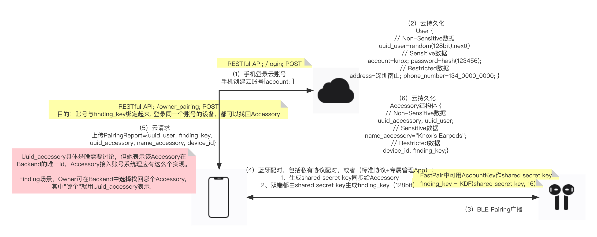
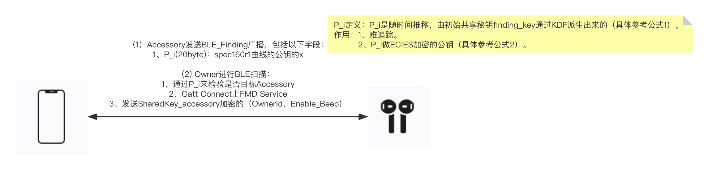
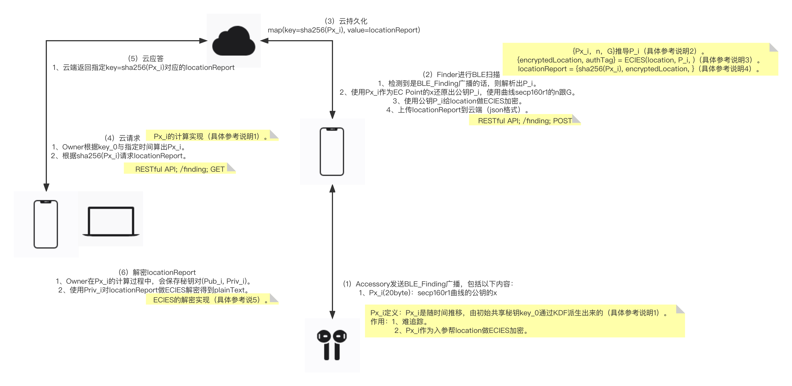

## 自然而然

通过分析Apple-FindMy《Find_My_network_accessory_protocol_specification.pdf》方案，结合对Google FastPair方案的理解，个人想出的一种自然而然的方案。

### 近场配对

细节说明：

1、近场配对时，两端会协商出一个共享密钥（shared secret key），譬如FastPair就有AccountKey（128-bit）。

2、MyFinding基于shared secret key，利用派生函数KDF（”finding_key“，16）生成finding_key（128-bit）。

3、Owner通过Finding characteristic使能Accessory的Finding状态。

* Owner向Accessory读nonce
* Owner发送消息验证码auth_code=Hash(finding_key, nonce)给Accessory
* Accessory校验auth_code决定是否要使能Finding状态

4、Accessory进入Finding状态后，低频发BLE_Finding广播。

5、Owner将PairingReport上传到Backend做持久化。

疑虑疑问：

### 近场找回

细节说明：

1、Accessory发送BLE_Finding广播。

2、Owner计算预期的P_与广播中解析出来的P_i相比较。

3、Owner discover到Finding characteristic的话，使能Ringing状态。

* Owner向Accessory读nonce
* Owner发送消息验证码auth_code=Hash(finding_key, nonce)给Accessory
* Accessory校验auth_code决定是否要使能Ringing状态

疑虑疑问：

### 远场发现

细节说明：

1、Accessory使能Finding状态后，发送BLE_Finding广播

2、

疑虑疑问：